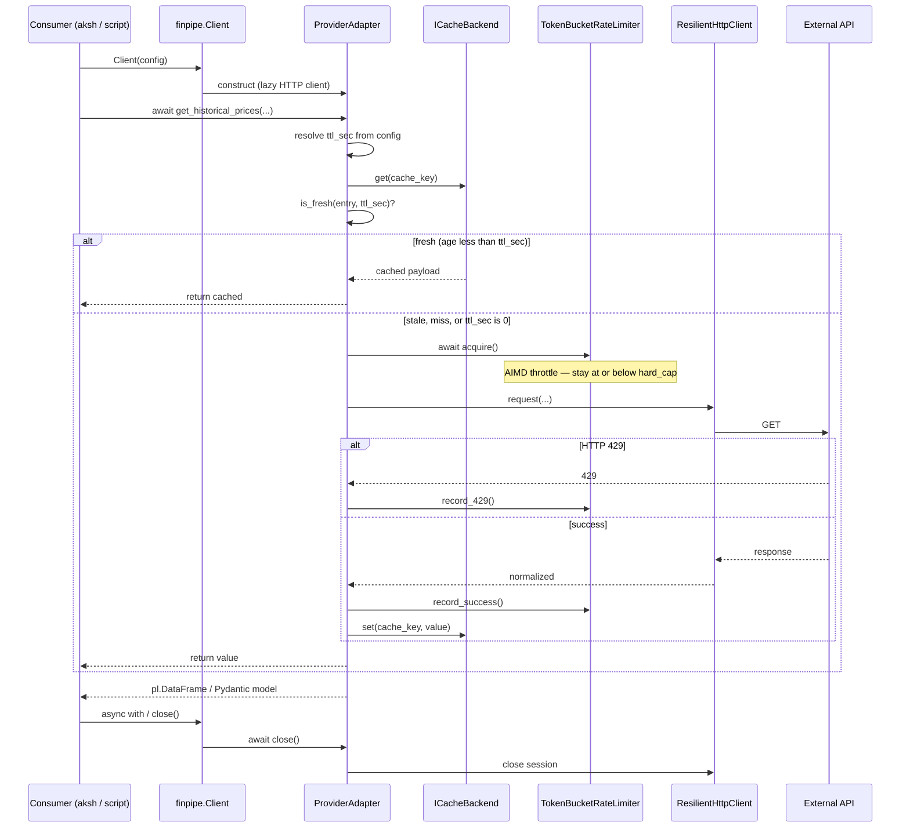
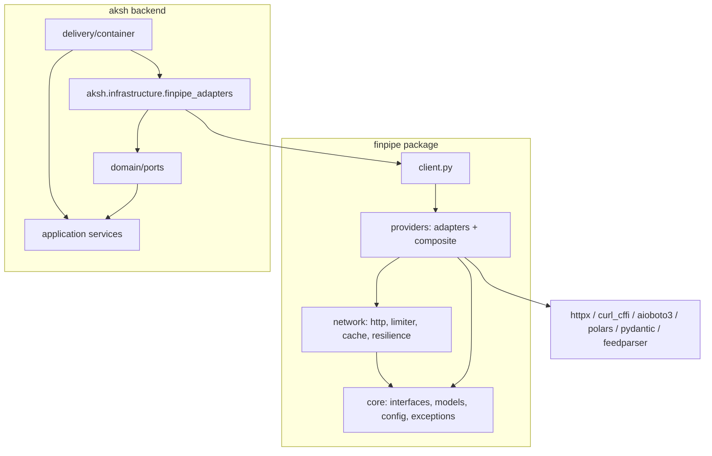
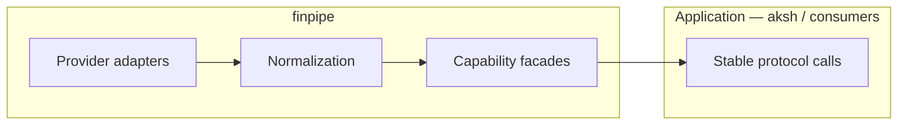

# finpipe — Standalone Provider Package Architecture Plan

## Executive summary

**finpipe** is a standalone Python package that extracts all external market-data, macro, screener, sentiment, and LLM provider logic currently embedded in **aksh** (`backend/infrastructure/providers/`, `backend/core/network/`, and related wiring). It owns HTTP resilience, rate limiting, caching, provider-specific parsing, and normalized return types. **aksh** keeps domain logic, ML, SQLite persistence, HTTP API, and thin **adapter layers** that map finpipe's normalized outputs into aksh domain ports (`EquityMarketDataPort`, `SocialSentimentPort`, etc.).

The design is **interface-segregated** (not a single God-protocol like aksh's `PriceProvider`), **registry-driven** (matching aksh's proven `@register_equity` / `@register_options` pattern), **facade-first** (`Client` for library users, composite services for primary/fallback routing), **provider-agnostic at the application boundary**, and **fully asynchronous** — every provider is accessed via `async`/`await` with no synchronous public API. It is informed by:

- Existing (incomplete) docs at `docs/finpipe_architecture.md`
- finpipe **tests** that define the intended public API (source package not present in workspace; tests import `finpipe.*`)
- aksh **as-built** patterns in `backend/infrastructure/providers/` and `Architecture.md` §7.1–7.2

---

## Goals and non-goals

### Goals

| Goal | Rationale |
|------|-----------|
| Single installable package for all external data I/O | aksh today mixes providers with ML, SQLite, and HTTP delivery |
| Interface segregation by capability | aksh's `PriceProvider` is 10+ methods; finpipe splits by consumer need |
| Normalized outputs (Polars + Pydantic) | Remove per-app adapter scripts like aksh's `pandas_ohlcv_to_polars` |
| Built-in resilience (rate limits, retries, circuit breakers, cache) | Port aksh **`AdaptiveRateLimiter`** (AIMD) for stable max-throughput without 429s |
| Adaptive maximum-throughput control | Honor configured hard caps always; probe up via additive increase; backoff on 429 — target **100% caller success** |
| Modern transport stack | Pluggable transports: **httpx** (REST APIs), **curl_cffi** (scraping/anti-bot), **aioboto3** (S3), **yfinance** (Yahoo) |
| Aksh parity (tiebreaker) | **When in doubt, use the library aksh already uses** — see inventory below |
| Registry + primary/fallback facades | Proven in aksh `EquityDataService` / `OptionsDataService` |
| Env-driven config with JSON overrides | Matches finpipe tests (`FinpipeConfig.from_json`) and aksh `.env` culture |
| IDE-like settings file per provider | `finpipe.settings.json` controls rate limits, quotas, TTLs, retries per API |
| Optional extras (`finpipe[yahoo]`, `[massive]`, etc.) | Keep core lean; heavy deps only when needed |
| Stable semver public API | aksh pins finpipe version; breaking changes require major bump |
| Provider-agnostic application API | Apps depend on capability facades + normalized types, not on Yahoo/Massive/etc. |
| Backward-compatible evolution | New providers and provider swaps are config/registry changes only for consumers |
| Application-controlled persistence | finpipe always stores fetches; each app chooses TTL + cache backend for its freshness/durability needs |
| Shared singleton cache DB | One cache database per application, shared by all `Client` instances; thread-safe reads/writes required |
| Async-only provider I/O | All providers accessed via `async`/`await`; no sync public methods on protocols or `Client` |

### Non-goals

| Non-goal | Stays in aksh |
|----------|---------------|
| ML inference, feature compilation, model registry | `RandomForestBrain`, `FeatureLoader`, etc. |
| SQLite persistence, scan jobs, predictions | Domain ports + adapters |
| FastAPI routes, React UI | `delivery/http/` |
| `CancelToken` propagation | aksh application concern; finpipe accepts optional `AbortSignal`-style hook later |
| `RejectingPriceProvider` / bad-ticker registry | aksh domain + persistence (`bad_equity_tickers`) |
| S3 flatfile ingest orchestration into SQLite | aksh `S3SyncService` + ingesters; finpipe exposes raw S3 download API only |
| LLM memo/chat routing (`LlmRoutingConfig`) | aksh `RouterAILlmAdapter`; finpipe exposes raw `ILLMProvider` |
| Business-specific DTOs (`FundamentalSnapshot`, `SocialMetrics`) | aksh domain types; mapped in aksh adapters |

---

## Current state (as-built aksh vs finpipe workspace)

### aksh provider layout (source of truth for migration)

```
aksh/backend/
├── core/
│   ├── interfaces/
│   │   ├── base_data.py          # BaseDataProvider ABC
│   │   ├── base_rest_api.py      # ResilientHttpClient wiring
│   │   └── protocols.py          # PriceProvider, SocialProvider, ExternalApiClient
│   ├── config/
│   │   ├── provider_limits.py    # Hard RPS/RPM caps per namespace
│   │   └── config_schemas.py     # equity_data.primary/fallback, etc.
│   └── network/                  # Re-exports infrastructure/resilience
├── infrastructure/
│   ├── providers/
│   │   ├── data_providers/
│   │   │   ├── equity/           # registry, factory, service, yahoo, alpha_vantage
│   │   │   ├── options/          # registry, factory, service, massive, yahoo_options
│   │   │   ├── macro/fred.py
│   │   │   └── social/stocktwits.py
│   │   ├── market_intel/         # RSS adapters, aggregators, factory
│   │   └── equity/
│   │       └── port_adapters.py  # PriceProvider → domain ports
│   └── resilience/               # rate limiting, circuit breaker, TTL cache
└── delivery/wiring/
    ├── equity_providers.py       # build_equity_provider_stack()
    └── app_services.py           # build_provider_stack()
```

**Key aksh patterns to preserve:**

1. **Decorator registry** — `register_equity("yfinance")` in `equity/adapters/yahoo.py`, side-effect import in `adapters/__init__.py`
2. **Build context dataclass** — `EquityBuildContext(config=...)`
3. **Primary/fallback facade** — per-method fallback in `EquityDataService` (empty DataFrame / None triggers fallback)
4. **Namespace-scoped HTTP client** — `BaseRestApi.get_namespace()` → rate limiter key
5. **Hard caps** — `provider_limits.py` clamps adaptive limiters

### finpipe workspace state

- `finpipe/` has **tests**, **scripts**, **docs**, `pyproject.toml` — package source lives under **`src/`** (mapped to import name `finpipe`).
- Tests define the **intended API** (`Client`, adapters, config, exceptions, network layer).

---

## Package layout (directory tree)

Recommended **src layout** (PEP 621 + setuptools). The installable package is **`finpipe`**, mapped from `src/` via `package-dir` (no extra `finpipe/` folder on disk):

```text
finpipe/
├── pyproject.toml
├── finpipe.settings.json         # project settings (committed; no secrets)
├── finpipe.settings.local.json   # optional gitignored overrides
├── README.md
├── docs/
│   ├── architecture.md           # System design
│   ├── api-reference.md          # Application guide + public API
│   ├── finpipe.settings.example.json
│   ├── finpipe.settings.schema.json   # JSON Schema for IDE autocomplete (generated)
│   ├── migration-from-aksh.md
│   └── provider-matrix.md
├── src/                          # maps to import name `finpipe` (see pyproject.toml)
│   ├── __init__.py               # finpipe.__init__
│   ├── py.typed
│   ├── client.py                 # Top-level Client facade
│   │
│   ├── core/
│   │   ├── interfaces.py         # All Protocol definitions
│   │   ├── models.py             # Pydantic DTOs
│   │   ├── exceptions.py         # Finpipe*Error hierarchy
│   │   ├── config.py             # FinpipeConfig + provider configs
│   │   ├── types.py              # Type aliases, Interval, DataFrameFormat
│   │   └── registry.py           # Generic ProviderRegistry[T]
│   │
│   ├── network/
│   │   ├── http.py               # ResilientHttpClient + pluggable async transports
│   │   ├── transports/           # httpx.py (REST default), curl_cffi.py (scraping)
│   │   ├── limiter.py            # AdaptiveRateLimiter (AIMD), TokenBucketRateLimiter (RPM/TPM)
│   │   ├── concurrency.py        # DynamicConcurrencyLimiter (from aksh)
│   │   ├── resilience.py         # Async retries + circuit breaker wrapper
│   │   ├── cache.py              # ICacheBackend (async get/set), InMemory, Sqlite
│   │   ├── cache_manager.py      # Process-wide singleton registry + lock coordination
│   │   └── sync_bridge.py        # asyncio.to_thread for sync-only vendor libs (internal)
│   │
│   ├── providers/
│   │   ├── __init__.py           # Import adapters → register
│   │   ├── base.py               # ProviderBase mixin (cache + http + limits)
│   │   ├── composite/            # CompositeEquityService, etc.
│   │   ├── yahoo.py
│   │   ├── alpha_vantage.py
│   │   ├── fred.py
│   │   ├── massive.py
│   │   ├── tradingview.py
│   │   ├── sentiment.py
│   │   ├── groq.py
│   │   └── gemini.py
│   │
│   └── _internal/
│       └── limits.py             # DEFAULT_PROVIDER_HARD_LIMITS (from aksh)
│
├── tests/
│   ├── conftest.py
│   ├── test_client.py
│   ├── core/
│   ├── network/
│   └── providers/
│
└── scripts/
    ├── test_pipeline.py
    └── test_json_config.py
```

### Package mapping (`pyproject.toml`)

`src/` is the on-disk root; imports remain `finpipe.*`:

```toml
[tool.setuptools.package-dir]
finpipe = "src"

[tool.setuptools]
packages = [
    "finpipe",
    "finpipe.core",
    "finpipe.network",
    "finpipe.providers",
    "finpipe.providers.composite",
    "finpipe._internal",
]
```

### Optional dependency groups (`pyproject.toml`)

```toml
[project.optional-dependencies]
yahoo = ["yfinance>=0.2.0"]       # aksh parity until native REST
fred = ["fredapi>=0.5.0"]           # aksh parity; optional curl_cffi REST upgrade
massive = ["aioboto3>=13.0.0"]      # aksh
sentiment = ["feedparser>=6.0.0"]
all = ["finpipe[yahoo,fred,massive,sentiment]"]
dev = ["pytest", "pytest-asyncio", "ruff", "basedpyright"]
```

---

## Application API stability (provider independence)

**Core rule:** Applications (including aksh) must never import or call provider-specific adapters. They call **capability facades** on `Client` that implement stable protocols. Provider choice is a **configuration concern**, not an application concern.

### Two API tiers

| Tier | Who uses it | Stability | Examples |
|------|-------------|-----------|----------|
| **Application API** | aksh, scripts, third-party apps | Semver-stable; backward compatible within major version | `client.equity`, `client.options`, `client.macro`, `client.intel`, `client.llm`, `client.screener`, `client.health`, `client.catalog` |
| **Provider API** | finpipe internals, provider tests, debugging | Unstable; may change when adapters are added/refactored | `client.yahoo`, `client.massive`, registry keys, `_internal/` |

Applications bind to **what** data they need (historical prices, options chain, macro series), not **where** it comes from.

### What stays constant when providers change

When you switch `equity_primary` from `yahoo` to `alpha_vantage`, or register a new options provider, the application interface **does not change**:

| Stable for applications | Changes only inside finpipe |
|-------------------------|----------------------------|
| Method names on capability facades (`get_historical_prices`, `get_options_chain`, …) | HTTP endpoints, parsers, rate-limit namespaces |
| Method signatures (existing positional/keyword args) | Provider-specific request/response shapes |
| Return types (`DataFrameLike` OHLCV schema, `OptionChain`, `TickerMetadata`, …) | Raw JSON/XML from external APIs |
| Exception types (`FinpipeDataNotFoundError`, …) | Vendor error codes and retry policies |
| `FinpipeConfig` routing keys (`equity_primary`, `options_fallback`, …) | New optional `providers.<name>` config blocks |

### Normalization boundary

Every provider adapter is responsible for translating vendor data into **canonical finpipe types** before returning to callers:

```text
External API (vendor-specific)
        ↓  parse + validate  (inside providers/<name>/)
Canonical model / schema     ← application sees only this
        ↓
Capability facade (CompositeEquityService, …)
        ↓
Application (aksh)
```

Canonical contracts (frozen within a major version):

- **OHLCV DataFrame:** columns `timestamp`, `open`, `high`, `low`, `close`, `volume` with fixed dtypes
- **Macro DataFrame:** columns `timestamp`, `value`
- **Structured data:** Pydantic models in `finpipe.core.models` with `extra="allow"` for forward-compatible field additions

If a new provider cannot populate a field, return `None` or an empty frame — never leak vendor column names or partial schemas to the application layer.

### Swapping providers (zero application diff)

```python
# Application code — unchanged across provider swaps
async with Client(config) as client:
    prices = await client.equity.get_historical_prices("AAPL", start, end)
    chain = await client.options.get_options_chain("AAPL")
```

```json
// overrides.json — only this changes to swap equity source
{
  "routing": {
    "equity_primary": "alpha_vantage",
    "equity_fallback": "yahoo"
  }
}
```

Adding a **new** provider (e.g. `polygon`):

1. Implement adapter under `src/providers/polygon/` (internal)
2. Register with `@register_provider("polygon", category="equity")` (internal)
3. Add `PolygonConfig` to `ProviderGroupConfig` (optional config block)
4. Set `"equity_primary": "polygon"` in routing config

**No changes** to application imports, method calls, or return-type handling.

### Backward-compatibility rules (semver)

| Change type | Allowed in | Application impact |
|-------------|-----------|-------------------|
| Add new provider adapter | Minor | None — opt-in via routing config |
| Add optional kwarg with default to protocol method | Minor | None — existing call sites unchanged |
| Add optional field to Pydantic model (`extra="allow"`) | Minor | None — extra fields ignored by older clients |
| Add new capability facade on `Client` (e.g. `client.crypto`) | Minor | None — existing facades unchanged |
| Rename/remove protocol method or required arg | **Major only** | Breaking — requires app update |
| Rename/remove OHLCV column or change dtype | **Major only** | Breaking |
| Remove exception type or change hierarchy | **Major only** | Breaking |
| Remove provider adapter | **Major only** | Deprecate for one minor; document migration path |

**Deprecation policy:** mark with `@deprecated`; keep behavior for one minor release; remove only in next major.

### Capability facades (application entry points)

`Client` exposes **capability-named** services as the primary API. These implement the public protocols and delegate to configured providers via registry + routing:

```python
class Client:
    # --- Application API (stable) ---
    equity: IHistoricalPriceProvider & IMetadataProvider   # CompositeEquityService
    options: IOptionsProvider                                # CompositeOptionsService
    macro: IMacroProvider                                    # CompositeMacroService (FRED + fallbacks)
    intel: IMarketIntelProvider                              # CompositeIntelService
    screener: CompositeScreenerService                              # Yahoo, Finviz, TradingView via ScreenerAdapter
    llm: ILLMProvider                                        # CompositeLlmService (Groq/Gemini routing)

    # --- Provider API (advanced / tests only — not for applications) ---
    # Exposed for integration tests and finpipe development; not semver-guaranteed.
    _providers: ProviderRegistry  # internal accessor
```

Applications and aksh adapters should type-hint against **`IHistoricalPriceProvider`**, **`IOptionsProvider`**, etc., or the composite instances on `Client` — never against `YahooFinanceAdapter`.

### Contract tests (API stability enforcement)

`tests/contract/` holds golden tests that lock the application boundary:

| Test | Guards |
|------|--------|
| `test_ohlcv_schema.py` | OHLCV column names and dtypes from any equity provider |
| `test_public_protocol_surface.py` | Protocol method names/signatures match documented API |
| `test_composite_routing.py` | Swapping `equity_primary` returns same schema, different source metadata optional |
| `test_backward_compat_fixtures.py` | Serialized model JSON from prior minor version still deserializes |

Provider-specific tests live under `tests/providers/` and may change freely.

### Anti-patterns (do not do in applications)

| Anti-pattern | Why |
|--------------|-----|
| `from finpipe.providers.yahoo import YahooFinanceAdapter` | Couples app to one vendor |
| `await client.yahoo.get_historical_prices(...)` in product code | Bypasses routing/fallback; breaks on provider swap |
| Branching on provider name in aksh | `if config.equity_primary == "yahoo"` belongs in finpipe composite only |
| Returning raw vendor JSON to domain layer | Defeats normalization; schema drift per provider |
| Importing `finpipe._internal` or registries | Internal; no stability guarantee |
| Sync/blocking provider calls in async apps | Use `await client.equity...`; never wrap with blocking sync shims in product code |

---

## Async-only provider access

**All providers are accessed asynchronously.** Every method on capability protocols, composite facades, and provider adapters that touches external I/O is `async`. There is **no synchronous public API** — no `get_historical_prices_sync()`, no blocking `Client` methods.

### Scope

| Layer | Async required |
|-------|----------------|
| Public protocols (`IHistoricalPriceProvider`, …) | **Yes** — all methods `async def` |
| `Client` + capability facades (`client.equity`, …) | **Yes** |
| Composite services (primary/fallback routing) | **Yes** |
| Provider adapters (Yahoo, FRED, Massive, …) | **Yes** — public adapter methods |
| HTTP client (`ResilientHttpClient`) | **Yes** — pluggable async transport (`httpx` for REST, `curl_cffi` for scraping) |
| Rate limiter | **Yes** — `await limiter.acquire()` |
| Cache backend (`ICacheBackend`) | **Yes** — `async def get/set` (SQLite via executor + lock) |
| `Client` lifecycle | **Yes** — `async with Client()` / `await client.close()` |

### Internal sync bridges (migration-only, not public)

During migration, any remaining synchronous vendor code is isolated behind **`sync_bridge.py`** and scheduled with `asyncio.to_thread`. **Target state: zero sync bridges** — all providers use native async I/O.

**Applications never import or call `sync_bridge`.**

---

## Modern transport and client libraries

finpipe ports **proven aksh provider I/O** into a standalone async package. Library selection follows **best tool per provider** — stable, efficient, and fast for each integration type — not one HTTP client for everything.

### Aksh parity rule (tiebreaker)

> **When in doubt, use the library aksh uses.**

Reference: `aksh/requirements.txt` and `aksh/backend/infrastructure/providers/`. aksh standardized on **`curl_cffi`** for most HTTP paths; finpipe may choose **`httpx`** for clean REST APIs where anti-bot TLS impersonation adds no value. Document deviations with parity tests.

#### aksh library inventory (production paths)

| Concern | aksh library | finpipe usage |
|---------|--------------|---------------|
| HTTP client (`ResilientHttpClient`) | **`curl_cffi`** 0.15 + `impersonate` | **Scraping / anti-bot** — TradingView, Reddit, Google News; Yahoo native REST (future) |
| Keyed REST APIs | **`curl_cffi`** in aksh | **`httpx`** preferred — Alpha Vantage, FRED REST, Massive REST, Groq, Gemini, StockTwits |
| Massive S3 | **`aioboto3`** | Same (`aiohttp` is transitive only — do not use directly) |
| Yahoo equity | **`yfinance`** + shared **`requests`** session | **`yfinance`** via `sync_bridge` (default); native REST on **`curl_cffi`** when parity tests pass |
| FRED macro | **`fredapi`** (sync) | **FRED REST on `httpx`** (implemented); `fredapi` via bridge only if REST gaps |
| Rate limiting | **`AdaptiveRateLimiter`** (SQLite-backed AIMD) | Port unchanged |
| In aksh requirements but **not used** in provider backend | `httpx`, `aiohttp` | **`httpx`** — production for REST; **`aiohttp`** — S3 transitive only |

finpipe improves on aksh by making all **public** APIs async, centralizing config, and picking the right transport per provider — not by copying curl_cffi everywhere.

### Best tool per provider (principle)

Choose transport by integration type:

| Integration type | Library | Examples |
|------------------|---------|----------|
| Keyed REST / JSON API | **`httpx`** | Alpha Vantage, FRED REST, Massive REST, Groq, Gemini, StockTwits |
| Anti-bot / scraping / browser TLS | **`curl_cffi`** | TradingView, Reddit, Google News RSS; Yahoo native REST (future) |
| Domain vendor SDK (sync) | **`sync_bridge`** | yfinance (Yahoo); fredapi only if REST gaps |
| AWS S3 async | **`aioboto3`** | Massive flatfiles |

Shared **`ResilientHttpClient`** wraps AIMD rate limiting, circuit breaker, and retries. Transport is selected per provider via `HttpConfig.transport` (or provider-specific defaults).

```python
class HttpConfig(BaseModel):
    transport: Literal["curl_cffi", "httpx"] = "httpx"   # override per provider; scraping defaults curl_cffi
    timeout_connect_sec: float = 10.0
    timeout_read_sec: float = 30.0
    impersonate: str | None = "chrome124"   # curl_cffi only (aksh uses chrome110)
    user_agent: str | None = None
    base_url: str | None = None
    http2: bool = True                        # httpx only
```

Settings example (mixed transports):

```json
"providers": {
  "fred": { "http": { "transport": "httpx" } },
  "tradingview": { "http": { "transport": "curl_cffi", "impersonate": "chrome124" } },
  "groq": { "http": { "transport": "httpx" } },
  "sentiment": {
    "sources": {
      "google_news": { "http": { "transport": "curl_cffi" } },
      "stocktwits": { "http": { "transport": "httpx" } },
      "reddit": { "http": { "transport": "curl_cffi", "user_agent": "finpipe-scraper/1.0" } }
    }
  }
}
```

### Design principle

| Use | Avoid in new finpipe code |
|-----|---------------------------|
| **`httpx`** for keyed REST APIs | `curl_cffi` where httpx suffices (unnecessary TLS impersonation) |
| **`curl_cffi`** for scraping / anti-bot endpoints | `httpx` on sites that fingerprint non-browser clients |
| **`aioboto3`** for S3 | Sync `boto3` in async adapters |
| **`yfinance`** / `fredapi` via `sync_bridge` when domain lib is more stable | Raw `requests` in adapter public methods |
| **`polars`** for time series | Ad-hoc pandas in hot paths |
| Port aksh parsers/normalizers | Reimplementing from scratch |
| Direct **`aiohttp`** for provider REST | Use httpx or curl_cffi via `ResilientHttpClient` |

### ResilientHttpClient (pluggable transport)

`ResilientHttpClient` owns AIMD rate limiting, circuit breaker, and tenacity retries. The HTTP backend is pluggable:

```python
class ResilientHttpClient:
    """Unified async HTTP — AIMD + resilience; transport from HttpConfig."""

    def __init__(self, namespace: str, config: RateLimitConfig, http: HttpConfig, ...):
        self._transport = create_transport(http)  # HttpxTransport | CurlCffiTransport

    async def request(self, method: str, url: str, **kwargs) -> Response:
        await self.rate_limiter.acquire()
        async with self.rate_limiter.concurrency.limit():
            ...
```

**`IHttpTransport`** abstraction: `HttpxTransport` (REST default), `CurlCffiTransport` (scraping).

### Current implementation gap

| Component | Target | Today |
|-----------|--------|-------|
| REST providers | `httpx` via `ResilientHttpClient` | ✅ `httpx` in `resilience.py` |
| Scraping providers | `curl_cffi` via transport plug-in | ❌ `CurlCffiHttpClient` in `http.py` exists but unwired |
| `HttpConfig.transport` | Honored per provider | ❌ Ignored by `create_resilient_http_client` |
| `transports/` module | `HttpxTransport`, `CurlCffiTransport` | ❌ Not created |
| Yahoo | `yfinance` + `sync_bridge` | ✅ inline `asyncio.to_thread` |
| FRED | FRED REST on `httpx` | ✅ implemented in `fred.py` |
| Massive S3 | `aioboto3` | ❌ not yet implemented |

### Provider → library matrix (target)

| Provider / source | Production transport | Notes |
|-------------------|---------------------|-------|
| **Yahoo** | `yfinance` + `sync_bridge` | `curl_cffi` REST = optional future migration |
| **Alpha Vantage** | `httpx` | Keyed REST |
| **FRED** | `httpx` (FRED REST) | `fredapi` optional, not default |
| **Massive REST** | `httpx` | Bearer token JSON |
| **Massive S3** | `aioboto3` | Not yet in code |
| **TradingView** | `curl_cffi` | `impersonate: chrome124` |
| **Groq** | `httpx` | OpenAI-compatible REST |
| **Gemini** | `httpx` | Generative Language REST |
| **google_news** | `curl_cffi` | RSS; browser TLS + custom UA |
| **stocktwits** | `httpx` | Public JSON API |
| **reddit** | `curl_cffi` | Bot detection; custom UA required |

### Yahoo migration

**Default:** keep **`yfinance`** behind `sync_bridge` — handles Yahoo crumb/cookie churn without ongoing REST maintenance.

**Optional Phase 2:** native v8/v7 REST on **`curl_cffi`** (not httpx — Yahoo can block non-browser TLS):

```text
GET query1.finance.yahoo.com/v8/finance/chart/{symbol}
GET query2.finance.yahoo.com/v7/finance/quote
```

### S3 (Massive flatfiles)

Port aksh `MassiveApiClient` S3 path — **`aioboto3`** (already in aksh).

### Banned in finpipe

| Banned | Use instead |
|--------|-------------|
| Raw `requests` in async adapters | `httpx`, `curl_cffi`, or `sync_bridge` for sync vendor libs |
| Direct `aiohttp` for provider REST | `httpx` or `curl_cffi` via `ResilientHttpClient` |
| `curl_cffi` on simple keyed REST APIs | `httpx` — simpler, excellent `respx` test support |
| Inventing new HTTP client per provider | Shared `ResilientHttpClient` + transport plug-in |

### Testing

| Path | Tool |
|------|------|
| httpx providers (REST APIs) | **`respx`** — production transport, not test-only |
| curl_cffi providers (scraping) | Mock `ResilientHttpClient.request` or golden fixtures |
| yfinance | Mock ticker methods |
| All | Contract tests on normalized outputs |

### Migration from aksh

| aksh today | finpipe action |
|------------|----------------|
| `curl_cffi` `ResilientHttpClient` | **httpx** for REST; **curl_cffi** for scraping — per matrix above |
| `AdaptiveRateLimiter` | **Port directly** |
| `yfinance` + `requests` | Keep via `sync_bridge` |
| `fredapi` | Prefer FRED REST on **httpx** (already implemented) |
| `aioboto3` Massive S3 | **Port directly** |
| Sync public APIs | Wrap; finpipe public API stays **async** |

### Concurrency benefits

```python
async with Client(config) as client:
    # Concurrent fetches — rate limiter + singleton cache coordinate safely
    prices, meta, cpi = await asyncio.gather(
        client.equity.get_historical_prices("AAPL", start, end),
        client.equity.get_metadata("AAPL"),
        client.macro.get_macro_series("DGS10", start, end),
    )
```

Async I/O allows aksh scan jobs, HTTP handlers, and batch scripts to run many provider calls concurrently without thread-per-request overhead, while shared rate limits and singleton cache prevent quota violations and duplicate fetches.

### Application integration

| Consumer | Pattern |
|----------|---------|
| **async FastAPI / aksh** | `await client.equity.get_historical_prices(...)` directly in route handlers / services |
| **Scripts / CLI** | `asyncio.run(main())` entry point |
| **Sync legacy code in aksh** | Thin adapter at aksh boundary only: `asyncio.run()` or schedule on running loop — **do not** add sync methods to finpipe |

aksh `FinpipeEquityMarketDataAdapter.fetch_ohlcv` remains `async` and awaits finpipe — matching existing aksh async domain ports.

### Provider adapter contract

```python
class ProviderBase:
    async def _cached_request(self, endpoint: str, ttl_key: str, fetch: Callable[[], Awaitable[T]]) -> T: ...

class YahooFinanceAdapter(ProviderBase):
    async def get_historical_prices(self, symbol: str, ...) -> DataFrameLike:
        return await self._cached_request(
            "historical_prices", "historical_prices_sec",
            lambda: self._fetch_historical_prices(symbol, ...),
        )

    async def _fetch_historical_prices(self, symbol: str, ...) -> DataFrameLike:
        response = await self.http.get(
            f"https://query1.finance.yahoo.com/v8/finance/chart/{symbol}",
            params={"period1": ..., "period2": ..., "interval": "1d"},
        )
        return self._normalize_ohlcv(response.json())
```

Sync code exists only inside `_fetch_*` helpers invoked via `run_sync` — never on the adapter's public surface.

### Testing

- All provider tests use **`pytest-asyncio`** (`asyncio_mode = "auto"`)
- Mock **`ResilientHttpClient.request`** or use fixture responses (not legacy httpx in prod)
- Sync bridge paths tested with `asyncio.to_thread` — assert event loop not blocked (`loop.time()` delta)

### Anti-patterns

| Do not | Do instead |
|--------|------------|
| `def get_prices(...)` on a protocol | `async def get_prices(...)` |
| `client.equity.get_historical_prices(...)` without `await` | `await client.equity.get_historical_prices(...)` |
| `asyncio.get_event_loop().run_until_complete(...)` inside running async app | `await` directly |
| Expose sync wrappers on `Client` for convenience | Document `asyncio.run()` for CLI scripts |
| Call blocking `requests` / sync `boto3` / `yfinance` from adapter public methods | `await self.http.request(...)` via **httpx** or **curl_cffi** per provider matrix, or `sync_bridge` for vendor libs |

### Migration from aksh sync providers

aksh today mixes sync legacy libs (`yfinance`, `fredapi`) and async **`curl_cffi`**. finpipe uses **best tool per provider** — **httpx** for REST, **curl_cffi** for scraping, **sync_bridge** for yfinance — not curl_cffi everywhere.

---

## Core interfaces

finpipe uses **`typing.Protocol`** (structural subtyping) for **application contracts**. All protocol methods that perform I/O are **`async def`**. Provider adapters implement them internally. `ProviderBase` and registries are not part of the application API.

### Capability protocols (`finpipe.core.interfaces`)

```python
from __future__ import annotations

from datetime import date
from typing import Any, Protocol, runtime_checkable

import polars as pl

from finpipe.core.models import (
    LLMResponse,
    NewsArticle,
    OptionChain,
    SentimentScore,
    TickerMetadata,
)
from finpipe.core.types import DataFrameLike, Interval


@runtime_checkable
class IHistoricalPriceProvider(Protocol):
    """OHLCV and spot prices."""

    async def get_historical_prices(
        self,
        symbol: str,
        start_date: date,
        end_date: date,
        *,
        interval: Interval = "1d",
    ) -> DataFrameLike: ...

    async def get_live_spot_price(self, symbol: str) -> float | None: ...


@runtime_checkable
class IMetadataProvider(Protocol):
    async def get_metadata(self, symbol: str) -> TickerMetadata: ...

    async def get_financial_statements(self, symbol: str) -> dict[str, Any]: ...


@runtime_checkable
class IOptionsProvider(Protocol):
    async def get_options_chain(
        self,
        symbol: str,
        expiration_date: date | None = None,
    ) -> OptionChain: ...

    async def get_options_snapshot(
        self,
        symbol: str,
        **filters: Any,
    ) -> DataFrameLike: ...


@runtime_checkable
class IMacroProvider(Protocol):
    async def get_macro_series(
        self,
        series_id: str,
        start_date: date,
        end_date: date,
    ) -> DataFrameLike: ...

    async def get_risk_free_rate(self, *, series_id: str = "DGS10") -> float: ...


@runtime_checkable
class IMarketIntelProvider(Protocol):
    async def get_news(
        self,
        symbol: str | None = None,
        *,
        limit: int = 20,
    ) -> list[NewsArticle]: ...

    async def get_sentiment_score(self, symbol: str) -> SentimentScore: ...


@runtime_checkable
class IScreenerProvider(Protocol):
    async def run_screener(self, criteria: dict[str, Any]) -> list[str]: ...


@runtime_checkable
class ILLMProvider(Protocol):
    async def generate_response(
        self,
        prompt: str,
        *,
        model: str | None = None,
        **kwargs: Any,
    ) -> LLMResponse: ...


@runtime_checkable
class ICloseable(Protocol):
    async def close(self) -> None: ...
```

### Internal provider contract (`finpipe.providers.base`)

Mirrors aksh `BaseRestApi` without forcing all methods on every provider:

```python
class ProviderBase(ICloseable):
    namespace: str
    config: AbstractProviderConfig

    @property
    def cache(self) -> ICacheBackend: ...
    @property
    def http(self) -> ResilientHttpClient: ...   # transport-agnostic async wrapper

    def cache_key(self, endpoint: str, *parts: str) -> str: ...
    async def _cached_request(self, ...) -> Any: ...  # async: TTL check → fetch → store
```

### aksh ↔ finpipe mapping

| aksh protocol / class | finpipe equivalent | Notes |
|----------------------|-------------------|-------|
| `PriceProvider` | `CompositeEquityService` implementing multiple protocols | Split internally |
| `EquityDataSource` | Same methods, renamed to finpipe protocol names | Migration shim |
| `OptionsDataSource` / `ExternalApiClient` | `IOptionsProvider` + S3 helpers on `MassiveOptionsAdapter` | |
| `SocialProvider` | Part of `NewsSentimentAdapter` / `IMarketIntelProvider` | |
| `FREDDataProvider` | `FredAdapter` (`IMacroProvider`) | aksh only used DGS10 sync |
| `MarketIntelService` | `CompositeIntelService` | Ordered source list |
| `LlmAnalystPort` | **Not in finpipe** | aksh wraps `ILLMProvider` |

---

## Data models / types

### Pydantic models (`finpipe.core.models`)

All models use `model_config = ConfigDict(extra="allow")` for forward compatibility.

```python
class TickerMetadata(BaseModel):
    symbol: str
    short_name: str | None = None
    sector: str | None = None
    industry: str | None = None
    market_cap: float | None = None
    currency: str | None = None
    exchange: str | None = None

class OptionContract(BaseModel):
    contract_symbol: str
    strike: float
    last_price: float | None = None
    bid: float | None = None
    ask: float | None = None
    volume: int | None = None
    open_interest: int | None = None
    implied_volatility: float | None = None
    in_the_money: bool | None = None

class OptionChain(BaseModel):
    symbol: str
    expiration_date: date
    calls: list[OptionContract]
    puts: list[OptionContract]

class NewsArticle(BaseModel):
    title: str
    url: str | None = None
    published_at: datetime | None = None
    source: str | None = None

class SentimentScore(BaseModel):
    symbol: str
    score: float          # -1.0 .. 1.0 normalized
    magnitude: int        # message/headline count
    source: str           # "stocktwits" | "lexicon" | "composite"

class LLMResponse(BaseModel):
    content: str
    model: str | None = None
    prompt_tokens: int | None = None
    completion_tokens: int | None = None
```

### Time-series schemas (enforced regardless of Polars/Pandas)

| Dataset | Required columns | dtypes |
|---------|-----------------|--------|
| OHLCV | `timestamp`, `open`, `high`, `low`, `close`, `volume` | `timestamp`: datetime; prices: float; volume: int/float |
| Macro | `timestamp`, `value` | `value`: float (`.` missing → null, per FRED test) |
| Options snapshot | provider-specific flat schema documented per adapter | Polars default |

### Type aliases (`finpipe.core.types`)

```python
Interval = Literal["1m", "5m", "15m", "1h", "1d", "1wk", "1mo"]
DataFrameFormat = Literal["polars", "pandas"]
DataFrameLike = pl.DataFrame | pd.DataFrame   # resolved at Client boundary
```

---

## Configuration model

finpipe uses a **settings-file-first** configuration model, similar to an IDE's `settings.json`: one declarative file controls global options and **every parameter for each provider individually**. Secrets stay in environment variables; everything else is tunable in the file without code changes.

### Design goals

| Goal | Detail |
|------|--------|
| IDE-like settings file | Single JSON (or JSONC) file; human-editable; checked into repo or per-user |
| Per-provider isolation | Each provider has its own block with rate limits, quotas, **TTLs (0 = always refetch)**, retries, endpoints |
| Sensible defaults | Omit keys → built-in defaults apply; file overrides only what you need |
| Layered precedence | Defaults → settings file → env vars → programmatic override |
| Schema validation | Pydantic validates on load; unknown keys warned (or rejected in strict mode) |
| Backward compatible | Adding new optional keys to provider blocks is always a minor-version change |

### Settings file discovery (like `.vscode/settings.json`)

finpipe searches for a config file in order; **first match wins** unless an explicit path is passed:

| Priority | Path | Typical use |
|----------|------|-------------|
| 1 (explicit) | `FinpipeConfig.from_file(path)` / `FINPIPE_CONFIG=/path/to/file` | CI, tests, one-off scripts |
| 2 | `./finpipe.settings.json` | Project-local (committed or gitignored) |
| 3 | `./.finpipe/settings.json` | Hidden project folder (like `.vscode/`) |
| 4 | `~/.config/finpipe/settings.json` | User-wide defaults (Linux/macOS) |
| 5 | `%APPDATA%/finpipe/settings.json` | User-wide defaults (Windows) |
| 6 | Built-in defaults + env vars only | No file present |

Recommended layout for a repo:

```text
finpipe/
├── finpipe.settings.json       # committed defaults (no secrets)
├── finpipe.settings.local.json # gitignored overrides (optional)
├── .env                        # secrets only (API keys)
└── .finpipe/
    └── settings.schema.json    # optional JSON Schema for IDE autocomplete
```

Support **JSONC** (comments + trailing commas) when `json5` or similar parser is available; fall back to strict JSON.

### Layered precedence

```text
Built-in defaults (code)
        ↓ overridden by
finpipe.settings.json (or discovered path)
        ↓ overridden by
finpipe.settings.local.json (optional second file, merged deeply)
        ↓ overridden by
Environment variables (secrets + selective overrides)
        ↓ overridden by
FinpipeConfig.from_file(..., overrides={...})  # programmatic, tests
```

Deep merge rules:

- Nested objects (`providers.yahoo.rate_limits`) merge recursively
- Scalars and arrays in a later layer replace the earlier value
- `null` in a file can reset a field to built-in default (explicit unset)

### Top-level: `FinpipeConfig`

```python
@dataclass(frozen=True)  # or pydantic BaseModel
class FinpipeConfig:
    dataframe_format: DataFrameFormat = "polars"
    cache: CacheConfig = field(default_factory=CacheConfig)
    routing: RoutingConfig = field(default_factory=RoutingConfig)
    providers: ProviderGroupConfig = field(default_factory=ProviderGroupConfig)

    @classmethod
    def load(cls, *, path: str | Path | None = None) -> FinpipeConfig:
        """Discover settings file, merge env, return validated config."""

    @classmethod
    def from_file(cls, path: str | Path, *, local_path: str | Path | None = None) -> FinpipeConfig: ...

    @classmethod
    def from_env(cls) -> FinpipeConfig: ...  # alias for load() with no explicit path

    def get_required_key(self, key: str) -> str: ...  # raises FinpipeConfigError
```

`from_json()` remains as a backward-compatible alias for `from_file()`.

### Example settings file (`finpipe.settings.json`)

Full reference copy: [`docs/finpipe.settings.example.json`](finpipe.settings.example.json).

```jsonc
{
  // Global finpipe options
  "dataframe_format": "polars",

  "cache": {
    "cache_type": "memory",
    "maxsize": 2048
  },

  "routing": {
    "equity_primary": "yahoo",
    "equity_fallback": "alpha_vantage",
    "options_primary": "massive",
    "options_fallback": "yahoo"
  },

  "providers": {
    "yahoo": {
      "enabled": true,
      "rate_limits": {
        "max_requests_per_second": 2.0,
        "max_requests_per_minute": 60,
        "max_requests_per_day": 2000
      },
      "resilience": {
        "max_retries": 3,
        "retry_backoff_base_sec": 1.0,
        "retry_backoff_max_sec": 30.0,
        "circuit_breaker_failure_threshold": 5,
        "circuit_breaker_reset_timeout_sec": 60.0,
        "allow_stale_on_rate_limit": true
      },
      "ttls": {
        "metadata_sec": 86400,
        "historical_prices_sec": 43200,
        "live_spot_price_sec": 0,
        "financials_sec": 86400,
        "options_sec": 300
      },
      "http": {
        "timeout_connect_sec": 10.0,
        "timeout_read_sec": 30.0,
        "user_agent": "finpipe/1.0"
      }
    },

    "alpha_vantage": {
      "enabled": true,
      "rate_limits": {
        "max_requests_per_second": 0.083,
        "max_requests_per_minute": 5,
        "max_requests_per_day": 500
      },
      "ttls": {
        "historical_prices_sec": 3600
      }
    },

    "fred": {
      "enabled": true,
      "rate_limits": {
        "max_requests_per_second": 2.0,
        "max_requests_per_day": 100000
      },
      "ttls": {
        "macro_sec": 0
      }
    },

    "massive": {
      "enabled": true,
      "rate_limits": {
        "max_requests_per_second": 5.0,
        "max_requests_per_day": 10000
      },
      "s3": {
        "endpoint": "https://files.massive.com",
        "bucket": "flatfiles",
        "flatfile_poll_interval_sec": 5.0
      }
    },

    "groq": {
      "enabled": true,
      "rate_limits": {
        "max_requests_per_minute": 30,
        "max_tokens_per_minute": 6000
      },
      "llm": {
        "default_model": "llama-3.3-70b-versatile",
        "max_tokens": 4096,
        "temperature": 0.2
      }
    }
  }
}
```

Secrets (`api_key`, S3 credentials) are **not** stored in the settings file — use `.env` or environment variables (see below).

### Per-provider config schema

Every provider extends a common base; provider-specific blocks add only what that API needs.

```python
class RateLimitConfig(BaseModel):
    """User-tunable hard limits and HTTP resilience. AIMD tuning is internal (see below)."""

    max_requests_per_second: float = 5.0          # hard cap (clamped to provider_limits)
    max_requests_per_minute: int | None = None    # optional RPM hard cap (LLM providers)
    max_tokens_per_minute: int | None = None      # optional TPM hard cap (LLM providers)
    max_retries: int = 3
    circuit_breaker_failure_threshold: int = 5
    circuit_breaker_recovery_timeout_sec: float = 60.0
    backoff_multiplier: float = 1.5

    # extra="forbid" — AIMD fields (min_rate, burst, additive_increase, etc.) are rejected

class ResilienceConfig(BaseModel):
    max_retries: int = 3
    retry_backoff_base_sec: float = 1.0
    retry_backoff_max_sec: float = 30.0
    retry_jitter: bool = True
    circuit_breaker_failure_threshold: int = 5
    circuit_breaker_reset_timeout_sec: float = 30.0
    allow_stale_on_rate_limit: bool = True

class TTLConfig(BaseModel):
    """Per data-type freshness window in seconds. All fetches are stored; TTL gates reuse."""

    default_sec: float | None = None       # fallback when a specific key is omitted
    metadata_sec: float = Field(default=86400, ge=0)
    historical_prices_sec: float = Field(default=43200, ge=0)
    live_spot_price_sec: float = Field(default=0, ge=0)   # 0 = refetch every call
    financials_sec: float = Field(default=86400, ge=0)
    options_sec: float = Field(default=300, ge=0)
    macro_sec: float = Field(default=86400, ge=0)         # FRED / macro series
    news_sec: float = Field(default=300, ge=0)
    sentiment_sec: float = Field(default=300, ge=0)
    screener_sec: float = Field(default=600, ge=0)
    llm_sec: float = Field(default=3600, ge=0)

class HttpConfig(BaseModel):
    transport: Literal["curl_cffi", "httpx"] = "httpx"   # per-provider override; scraping defaults curl_cffi
    timeout_connect_sec: float = 10.0
    timeout_read_sec: float = 30.0
    timeout_write_sec: float = 10.0
    impersonate: str | None = "chrome124"   # curl_cffi only (aksh: chrome110)
    user_agent: str | None = None
    base_url: str | None = None
    http2: bool = True                      # httpx only

class AbstractProviderConfig(BaseModel):
    enabled: bool = True
    rate_limits: RateLimitConfig = Field(default_factory=RateLimitConfig)
    resilience: ResilienceConfig = Field(default_factory=ResilienceConfig)
    ttls: TTLConfig = Field(default_factory=TTLConfig)
    http: HttpConfig = Field(default_factory=HttpConfig)

# --- Provider-specific extensions ---

class YahooConfig(AbstractProviderConfig):
    """Yahoo Finance — conservative defaults (unofficial API)."""
    # rate_limits defaults applied in provider __init__ if omitted:
    # max_requests_per_second=2.0, max_requests_per_day=2000

class AlphaVantageConfig(AbstractProviderConfig):
    api_key: str | None = None           # env: ALPHA_VANTAGE_API_KEY
    # free tier: 5 req/min, 500/day

class FredConfig(AbstractProviderConfig):
    api_key: str | None = None           # env: FRED_API_KEY

class MassiveConfig(AbstractProviderConfig):
    api_key: str | None = None           # env: MASSIVE_API_KEY
    access_key_id: str | None = None     # env: MASSIVE_ACCESS_KEY_ID
    secret_access_key: str | None = None # env: MASSIVE_SECRET_ACCESS_KEY
    s3: MassiveS3Config = Field(default_factory=MassiveS3Config)

class MassiveS3Config(BaseModel):
    endpoint: str | None = None          # env: MASSIVE_S3_ENDPOINT
    bucket: str | None = None            # env: MASSIVE_S3_BUCKET
    flatfile_poll_interval_sec: float = 5.0

class GroqConfig(AbstractProviderConfig):
    api_key: str | None = None           # env: GROQ_API_KEY
    llm: LlmProviderConfig = Field(default_factory=LlmProviderConfig)

class GeminiConfig(AbstractProviderConfig):
    api_key: str | None = None           # env: GEMINI_API_KEY
    llm: LlmProviderConfig = Field(default_factory=LlmProviderConfig)

class LlmProviderConfig(BaseModel):
    default_model: str | None = None
    max_tokens: int = 4096
    temperature: float = 0.2

class SentimentConfig(AbstractProviderConfig):
    sources: list[str] = ["google_news", "reddit_rss", "stocktwits"]
    rss_timeout_sec: float = 15.0

class TradingViewConfig(AbstractProviderConfig):
    screener_timeout_sec: float = 30.0
    max_results: int = 500

class ProviderGroupConfig(BaseModel):
    yahoo: YahooConfig = Field(default_factory=YahooConfig)
    alpha_vantage: AlphaVantageConfig = Field(default_factory=AlphaVantageConfig)
    fred: FredConfig = Field(default_factory=FredConfig)
    massive: MassiveConfig = Field(default_factory=MassiveConfig)
    tradingview: TradingViewConfig = Field(default_factory=TradingViewConfig)
    sentiment: SentimentConfig = Field(default_factory=SentimentConfig)
    groq: GroqConfig = Field(default_factory=GroqConfig)
    gemini: GeminiConfig = Field(default_factory=GeminiConfig)

class CacheConfig(BaseModel):
    """Fetch-cache backend — one singleton instance per (path, namespace) per process."""

    cache_type: Literal["memory", "sqlite", "none"] = "sqlite"
    sqlite_path: str | None = None       # e.g. ".cache/finpipe/aksh.db"
    maxsize: int = 1024                  # memory LRU cap; sqlite prune threshold
    namespace: str = "default"           # key prefix — isolates logical tenants
    singleton: bool = True               # share backend across all Client instances (required for sqlite prod)
    busy_timeout_ms: int = 5000          # SQLite lock wait before FinpipeProviderDownError

class RoutingConfig(BaseModel):
    equity_primary: str = "yahoo"
    equity_fallback: str | None = "alpha_vantage"
    options_primary: str = "massive"
    options_fallback: str | None = "yahoo"
    intel_ticker_sources: list[str] = ["google_news", "reddit_rss", "stocktwits"]
    intel_macro_sources: list[str] = ["wsj_rss"]
    llm_primary: str = "groq"
    llm_fallback: str | None = "gemini"
```

### How rate limits are enforced per provider

**Design goal:** stable, high-throughput provider access at **100% caller-visible success** — no avoidable `429` responses, no quota overruns. finpipe proactively throttles to stay at or below configured maximum rates while adaptively probing the highest sustainable throughput (aksh **`AdaptiveRateLimiter`** / AIMD algorithm).

**Source of truth for port:** `aksh/backend/infrastructure/resilience/rate_limiting.py`, `aksh/backend/core/config/provider_limits.py`, `aksh/backend/core/network/http_client.py`, `aksh/tests/test_rate_limit_contracts.py`.

#### Hard caps vs adaptive rate (never exceed maximum)

```text
settings max_requests_per_second  ──► clamp ──► hard_cap (absolute ceiling)
                                                    ▲
provider_limits.py DEFAULT_*        ──► min(user, documented cap)
                                                    │
                              AdaptiveRateLimiter.rate (current) ≤ hard_cap always
```

| Concept | Meaning |
|---------|---------|
| **`hard_cap`** | Maximum RPS from settings / `provider_limits` — **never exceeded**, even after 1000 `record_success()` calls |
| **`rate` (current)** | Live token-bucket fill rate — AIMD adjusts between `min_rate` and `hard_cap` |
| **`learned_max`** | Highest RPS bucket with ≥90% success (≥20 samples) in SQLite histogram |
| **`min_rate`** | Internal AIMD floor after 429 backoff — not user-configurable |

User-configured `max_requests_per_second` (and optional RPM/TPM caps) are clamped to documented hard caps (`finpipe._internal.limits`); inflating config cannot bypass vendor limits (aksh regression contract).

**AIMD tuning is internal:** additive increase, multiplicative decrease, burst capacity, initial rate, and success thresholds live in `finpipe._internal.aimd` — not in `finpipe.settings.json`. Users influence adaptive behavior only by changing hard caps (e.g. lowering `max_requests_per_second` tightens the ceiling the limiter probes toward).

#### AdaptiveRateLimiter (AIMD) — port from aksh

Every HTTP-based provider gets one **`AdaptiveRateLimiter`** keyed by `namespace`. Sync providers (yfinance) share the same limiter via `ProviderBase`.

```python
class AdaptiveRateLimiter:
    """AIMD token-bucket limiter with SQLite-backed rate learning (aksh port)."""

    namespace: str
    hard_cap: float           # absolute max RPS — never exceed
    min_rate: float           # floor after backoff
    rate: float               # current token refill rate (adaptive)
    learned_max: float        # from success histogram
    capacity: int             # burst bucket size
    concurrency: DynamicConcurrencyLimiter  # bounds in-flight requests

    async def acquire(self) -> None: ...       # smooth throttle; asyncio.sleep until token
    def record_success(self) -> None: ...       # AIMD additive increase
    def record_429(self) -> None: ...           # AIMD multiplicative decrease
```

**Request lifecycle (every provider API call):**

```text
1. await rate_limiter.acquire()           # proactive throttle — prevents 429
2. async with rate_limiter.concurrency.limit():
3.     response = await http.request(...)
4.     if status == 429:
5.         rate_limiter.record_429()       # rate *= 0.75 (floor min_rate)
6.         raise FinpipeRateLimitExceededError
7.     rate_limiter.record_success()      # AIMD increase toward learned_max / hard_cap
```

**AIMD rules (match aksh):**

| Event | Action |
|-------|--------|
| **Success** | Log histogram bucket; if `rate < learned_max` → `rate += 0.5` RPS; else every **50** consecutive successes below `hard_cap` → `+0.5` RPS |
| **429 received** | `rate = max(min_rate, rate × 0.75)`; reset success streak; recalculate `learned_max` |
| **Acquire** | Token bucket refill at `rate` tokens/sec; `asyncio.sleep` for deficit — **steady flow, no burst-then-starve** |

**Dynamic concurrency** (`DynamicConcurrencyLimiter`): caps in-flight requests to `max(1, int(rate × latency_multiplier))` so thousands of concurrent asyncio tasks queue cleanly instead of stampeding the provider.

#### LLM providers — dual RPM + TPM limiter

Groq/Gemini enforce **requests-per-minute** and **tokens-per-minute** concurrently via aksh's **`TokenBucketRateLimiter`** (dual bucket), in addition to `AdaptiveRateLimiter` RPS:

```python
await adaptive_limiter.acquire()
await rpm_tpm_limiter.acquire(tokens=prompt_token_estimate)
```

#### Per-provider wiring

```text
providers.yahoo.rate_limits     → AdaptiveRateLimiter("yfinance")
providers.fred.rate_limits      → AdaptiveRateLimiter("fred")
providers.massive.rate_limits   → AdaptiveRateLimiter("massive")
providers.groq.rate_limits      → AdaptiveRateLimiter("groq") + TokenBucketRateLimiter(rpm, tpm)
```

Configuration fields are defined in **`RateLimitConfig`** (see per-provider config schema above).

#### Quota dimensions

Adaptive state is persisted to SQLite (`.cache/finpipe/rate_limits.db` by default, or the cache DB when `cache.cache_type` is `sqlite`) — separate `api_rate_limits` table, port aksh schema:

```sql
CREATE TABLE api_rate_limits (
    namespace TEXT PRIMARY KEY,
    current_rate REAL,
    last_updated REAL
);
CREATE TABLE api_rate_histogram (
    namespace TEXT,
    rate_bucket REAL,
    successes INTEGER DEFAULT 0,
    failures INTEGER DEFAULT 0,
    PRIMARY KEY (namespace, rate_bucket)
);
```

Restarting the application resumes at last learned `current_rate` — no cold-start quota spike.

#### Quota dimensions

| Limit type | Mechanism |
|------------|-----------|
| `max_requests_per_second` | User hard cap — `AdaptiveRateLimiter` ceiling + AIMD current rate |
| `max_requests_per_minute` | User hard cap — `TokenBucketRateLimiter` RPM bucket (LLM) |
| `max_tokens_per_minute` | User hard cap — `TokenBucketRateLimiter` token bucket (LLM) |
| AIMD burst / increase / decrease | Internal constants in `finpipe._internal.aimd` |
| `max_concurrent_requests` | `DynamicConcurrencyLimiter` (derived from current adaptive rate) |

Daily quotas use the singleton cache SQLite backend.

#### 100% success rate — operational meaning

| Layer | Behavior |
|-------|----------|
| **Proactive** | `acquire()` throttles before request — **prevents avoidable 429s** |
| **Reactive** | On 429: AIMD backoff + retry with jitter (tenacity) |
| **Degradation** | If still rate-limited: optional stale cache return (`allow_stale_on_rate_limit`) |
| **Hard stop** | Daily/minute quota exhausted → `FinpipeRateLimitExceededError` (no silent overrun) |

Success metric for tuning: **≥99.9% HTTP success** (no 429/5xx after retries) at **≥95% of hard_cap** sustained throughput in integration probes. Golden regression tests port `aksh/tests/test_rate_limit_contracts.py`.

#### Concurrency contract tests (rate limiting)

`tests/network/test_adaptive_limiter.py` (port from aksh):

- Adaptive limiter never exceeds documented hard cap after 100 `record_success()` calls
- `record_429()` reduces rate; subsequent acquires spread requests in time
- Inflated `max_requests_per_second` in config still clamped to `provider_limits`
- 1000 concurrent `acquire()` + mock HTTP → zero 429 in respx simulation at cap

`tests/network/test_limiter.py` retains dual-bucket RPM/TPM tests for LLM limiters.

### Per-provider TTL (cache freshness)

Every provider has a **`ttls`** block. finpipe **always stores** successful fetches in the cache backend. Before each request, it **checks TTL** to decide whether the stored entry is still fresh enough to return without calling the external API.

**Core rule:** cache write on every successful fetch; cache read only when `age < ttl_sec`.

#### Semantics

| TTL value | On request | After successful fetch |
|-----------|--------------|------------------------|
| **`> 0`** | Return cached data if present and `age < ttl_sec`; otherwise fetch from provider | **Always** write/update cache |
| **`0`** | **Never** treat cache as fresh — always fetch from provider | **Always** write/update cache (keeps latest snapshot) |
| **Omitted key** | Use `ttls.default_sec` if set; else provider built-in default | Always write |

`ttl_sec == 0` does **not** skip caching. It means “always refetch on the next call,” while still retaining the most recent result in cache (useful for stale-on-rate-limit fallback, debugging, and observability).

To disable caching entirely (no read **or** write), set global `cache.cache_type: "none"`.

#### Freshness check

```python
def is_fresh(entry: CacheEntry, ttl_sec: float) -> bool:
    if ttl_sec <= 0:
        return False                    # TTL 0 → always stale for normal reads
    return entry.age_seconds < ttl_sec
```

#### Endpoint → TTL key mapping

Each adapter method resolves TTL via a fixed lookup (applications never pass cache keys):

| Capability method | TTL config key | Typical default |
|-------------------|----------------|-----------------|
| `get_historical_prices` | `historical_prices_sec` | 43200 (12h) |
| `get_live_spot_price` | `live_spot_price_sec` | **0** (refetch every call) |
| `get_metadata` | `metadata_sec` | 86400 (24h) |
| `get_financial_statements` | `financials_sec` | 86400 |
| `get_options_chain` / `get_options_snapshot` | `options_sec` | 300 (5m) |
| `get_macro_series` / `get_risk_free_rate` | `macro_sec` | 86400 |
| `get_news` | `news_sec` | 300 |
| `get_sentiment_score` | `sentiment_sec` | 300 |
| `run_screener` | `screener_sec` | 600 |
| `generate_response` (LLM) | `llm_sec` | 3600 |

#### Application configuration

Applications control TTL through **`finpipe.settings.json`** (or programmatic `FinpipeConfig`):

```json
"providers": {
  "yahoo": {
    "ttls": {
      "historical_prices_sec": 3600,
      "live_spot_price_sec": 0,
      "metadata_sec": 86400
    }
  },
  "fred": {
    "ttls": {
      "macro_sec": 0
    }
  }
}
```

With `live_spot_price_sec: 0`, every spot-price call refetches from Yahoo, but the latest quote is still stored in cache.

Programmatic override (tests, one-off scripts):

```python
config = FinpipeConfig.load().model_copy(
    update={
        "providers": {
            "yahoo": {
                "ttls": {"historical_prices_sec": 0, "live_spot_price_sec": 0}
            }
        }
    }
)
```

Environment override (optional):

| Variable | Maps to |
|----------|---------|
| `FINPIPE_YAHOO_TTL_HISTORICAL_PRICES_SEC` | `providers.yahoo.ttls.historical_prices_sec` |
| `FINPIPE_<PROVIDER>_TTL_<KEY>` | `providers.<provider>.ttls.<key>` |

#### Cache flow with TTL

```text
request(method, symbol, ...)
    │
    ├─ resolve ttl_sec from providers.<namespace>.ttls.<key>
    │
    ├─ entry = cache.get(key)                    # always read (unless cache_type=none)
    │
    ├─ entry exists AND is_fresh(entry, ttl_sec)
    │       └─► return entry.value               # skip provider call
    │
    └─ otherwise (miss, expired, or ttl_sec == 0)
            ├─ rate limit ──► HTTP ──► normalize
            ├─ cache.set(key, value)             # always store on success
            └─► return value
```

#### Stale cache on rate limit

When a fetch fails with `FinpipeRateLimitExceededError` and `resilience.allow_stale_on_rate_limit` is true, finpipe may return the **most recent cached entry** even if `age >= ttl_sec` (or `ttl_sec == 0`). This is an explicit degradation path — not normal cache reuse.

#### Default TTLs per provider

Built-in defaults differ by provider and data volatility (override in settings file):

| Provider | Notable defaults | Rationale |
|----------|------------------|-----------|
| yahoo | `live_spot_price_sec: 0` | Refetch every call; still cached after fetch |
| yahoo | `historical_prices_sec: 43200` | Daily bars change slowly |
| alpha_vantage | `historical_prices_sec: 3600` | Conserve quota |
| fred | `macro_sec: 86400` | Macro series update daily/monthly |
| massive | `options_sec: 300` | Options chains move quickly |
| groq / gemini | `llm_sec: 3600` | LLM responses rarely need repeat |
| sentiment | `news_sec: 300`, `sentiment_sec: 300` | News feeds refresh often |

### Shared singleton cache database (mandatory design constraint)

Each **application deployment** owns **one logical cache database** that is shared by **every `Client` instance** created in that process (and optionally across processes on the same host via SQLite WAL). This is required so concurrent workers, threads, and async tasks do not duplicate provider fetches or corrupt cached state.

**Feasibility:** This is **achievable and required** for the architecture as specified. finpipe will not ship SQLite-backed persistence without verified thread-safe singleton access. If the implementation cannot pass concurrency contract tests, SQLite cache is **disabled at runtime** and finpipe raises `FinpipeConfigError` on `Client()` construction rather than serving unsafe reads/writes.

#### Singleton registry (`finpipe.network.cache_manager`)

```python
class CacheManager:
    """Process-wide registry — one ICacheBackend per cache identity."""

    _instances: ClassVar[dict[str, ICacheBackend]] = {}
    _init_lock: ClassVar[threading.RLock] = threading.RLock()

    @classmethod
    def get_shared(cls, config: CacheConfig) -> ICacheBackend:
        key = cls._identity(config)   # f"{cache_type}:{sqlite_path}:{namespace}"
        with cls._init_lock:
            if key not in cls._instances:
                backend = cls._create_backend(config)
                if not backend.verify_thread_safe():
                    raise FinpipeConfigError("Cache backend failed thread-safety self-test")
                cls._instances[key] = backend
            return cls._instances[key]

    @classmethod
    def shutdown(cls) -> None:
        """Close and drop all singleton backends (called from Client.close())."""
        ...


def resolve_cache_backend(config: CacheConfig) -> ICacheBackend:
    """Adapters call this — shared singleton when config.singleton is true."""
    return CacheManager.get_shared(config) if config.singleton else create_cache_backend(config)
```

All provider adapters call `resolve_cache_backend(config.cache)` — never instantiate `SqliteCacheBackend` directly. `SqliteCacheBackend` keeps one SQLite connection per instance and implements `close()` for explicit teardown.

```text
App process
├── Client()  ──┐
├── Client()  ──┼──► CacheManager.get_shared() ──► SqliteCacheBackend (singleton)
└── Client()  ──┘         ▲
                          └── same .db file, same locks
```

#### Concurrency model

finpipe runs **async** provider I/O with **sync** SQLite and optional **thread-pool** bridges (`sync_bridge`). The cache layer must be safe across:

| Scenario | Mechanism |
|----------|-----------|
| Multiple `asyncio` tasks | `asyncio.Lock` per backend instance serializes async `get`/`set` entry points |
| Multiple OS threads | `threading.RLock` inside backend; SQLite `check_same_thread=False` with connection-per-thread or guarded connection pool |
| Multiple `Client` instances | Singleton registry returns same backend |
| Multiple processes (same host, same `.db`) | SQLite **WAL mode** + `busy_timeout_ms` + retry on `SQLITE_BUSY` |
| Multiple machines | **Not supported** on SQLite — use custom `ICacheBackend` (Redis); document as extension |

#### SQLite implementation requirements

```sql
PRAGMA journal_mode=WAL;
PRAGMA synchronous=NORMAL;
PRAGMA busy_timeout=5000;
PRAGMA foreign_keys=ON;
```

Schema (atomic upsert per key):

```sql
CREATE TABLE IF NOT EXISTS cache_entries (
    cache_key     TEXT PRIMARY KEY,
    namespace     TEXT NOT NULL,
    payload       BLOB NOT NULL,          -- msgpack/pickle/json serialized
    fetched_at    REAL NOT NULL,          -- monotonic or UTC epoch seconds
    expires_at    REAL,                   -- NULL = never expires for TTL check (ttl=0 still stores)
    content_hash  TEXT                    -- optional integrity check
);
CREATE INDEX IF NOT EXISTS idx_cache_namespace ON cache_entries(namespace);
```

| Operation | Transaction | Consistency |
|-----------|-------------|-------------|
| **get** | `BEGIN DEFERRED` → `SELECT` → check `expires_at` in SQL or Python atomically → `COMMIT` | Read sees committed write; no partial blobs |
| **set** | `BEGIN IMMEDIATE` → `INSERT OR REPLACE` → `COMMIT` | Atomic replace per key |
| **delete / prune** | `BEGIN IMMEDIATE` → batch delete expired → `COMMIT` | Does not interleave with partial reads |

Writes hold `BEGIN IMMEDIATE` briefly to reserve the writer lock. Reads use WAL concurrent access and never block the event loop longer than `busy_timeout_ms`.

#### Consistency guarantees

| Guarantee | Scope | Notes |
|-----------|-------|-------|
| **No torn reads** | Single process | Blob written fully inside one transaction before commit |
| **Read-your-writes** | Single process | Same task sees its write immediately after `set` returns |
| **Cross-instance consistency** | Single process | All `Client` instances share singleton — see same latest commit |
| **Cross-process eventual consistency** | Same host, WAL | Last committed write wins; brief `SQLITE_BUSY` retries |
| **Linearizable cross-machine** | — | **Not** with SQLite; requires Redis/custom backend |

These guarantees apply to **finpipe fetch cache** only. They do not replace aksh domain DB transactions.

#### Failure policy (do not run unsafe)

```python
# At CacheManager.get_shared() / Client.__init__
if config.cache.cache_type == "sqlite":
    backend = SqliteCacheBackend(...)
    if not backend.verify_thread_safe():          # runs built-in stress probe
        raise FinpipeConfigError(
            "SQLite cache failed concurrency self-test; "
            "set cache.cache_type=memory for dev or fix permissions/locking"
        )
```

`verify_thread_safe()` runs a miniature concurrent read/write burst (used in CI). **No silent fallback** to per-instance caches in production sqlite mode.

#### `memory` and `none` modes

| Mode | Singleton | Production use |
|------|-----------|----------------|
| `sqlite` + `singleton: true` | Yes — **default for production** | Required for shared persistence |
| `memory` + `singleton: true` | Yes — thread-safe locked dict | Dev/test only; not durable |
| `memory` + `singleton: false` | No | Isolated tests |
| `none` | N/A | No persistence |

#### Shutdown lifecycle

```python
async def close(self) -> None:
    await self._registry.close()          # HTTP adapters; non-singleton caches
    if self.config.cache.singleton:
        CacheManager.shutdown()           # closes SqliteCacheBackend connections
```

AIMD rate-limit SQLite writes in `AdaptiveRateLimiter` use `contextlib.closing(sqlite3.connect(...))` so connections are closed immediately after each persist operation (Python's `with conn:` only commits transactions, it does not close the connection).

#### Provider catalog `adapter_key`

Each `ProviderCatalogEntry` includes `adapter_key` — the internal registry name used by `ProviderRef` to delegate I/O. Intel sources share `"sentiment"`; screener sources (except TradingView) share `"screener"`; TradingView uses `"tradingview"`; most other rows use the provider id (e.g. `"yahoo"`, `"groq"`).

#### Concurrency contract tests (required before release)

`tests/network/test_cache_concurrency.py` (must pass in CI):

- 50 concurrent async tasks: mixed get/set on same key — no exceptions, final value consistent
- 20 OS threads: parallel get/set — no `SQLITE_BUSY` without successful retry, no corrupted payloads
- Two `Client` instances: write via client A, read via client B — read-your-writes
- TTL expiry under concurrency: only one fetch proceeds when cache expires (optional dedup lock per key)

#### Application wiring

```python
# All of these share ONE cache DB in the same process:
client_a = Client(FinpipeConfig.load())
client_b = Client(FinpipeConfig.load())
async with client_a as ca, client_b as cb:
    await ca.equity.get_historical_prices(...)   # may populate cache
    await cb.equity.get_historical_prices(...)   # cache hit if fresh — same singleton
```

Each **application** still uses its own `sqlite_path` / `namespace` in settings — singleton is **within** the app, not global across unrelated apps.

### Application-specific persistence policies

finpipe separates **storage** (always cache successful fetches) from **reuse policy** (TTL per data type). That split lets each application choose how aggressively to rely on stored data — without changing finpipe code or provider adapters.

```text
                    finpipe (same for all apps)
                    ┌─────────────────────────────┐
  Provider API ────►│ fetch → normalize → STORE   │
                    │         ▲                   │
                    │    TTL check on READ        │
                    └─────────┼───────────────────┘
                              │
         ┌────────────────────┼────────────────────┐
         │                    │                    │
    App A (aksh)         App B (research)      App C (live UI)
    sqlite + long TTL    sqlite + very long   memory + ttl=0
    historical=12h       historical=7d        always refetch
    spot=0                 spot=60              spot=0
```

#### What each application controls

| Knob | Settings path | Effect |
|------|---------------|--------|
| **Freshness** | `providers.<name>.ttls.*` | How long before finpipe refetches vs returns stored data |
| **Durability** | `cache.cache_type` | `memory` (process lifetime), `sqlite` (survives restarts), `none` (no store) |
| **Isolation** | `cache.namespace` + `cache.sqlite_path` | Separate cache files or shared file with prefixed keys |
| **Degradation** | `providers.<name>.resilience.allow_stale_on_rate_limit` | Use last stored snapshot when API rate-limits |

Applications do **not** implement provider caching themselves — they pass a `FinpipeConfig` (usually via their own `finpipe.settings.json`) when constructing `Client`.

#### Example: three applications, same finpipe package

**aksh (production backend)** — singleton SQLite shared by all workers in the process:

```json
{
  "cache": {
    "cache_type": "sqlite",
    "sqlite_path": ".cache/finpipe/aksh.db",
    "namespace": "aksh",
    "singleton": true,
    "busy_timeout_ms": 5000
  },
  "providers": {
    "yahoo": {
      "ttls": {
        "historical_prices_sec": 43200,
        "live_spot_price_sec": 0,
        "metadata_sec": 86400
      }
    }
  }
}
```

**Batch research job** — minimize API calls; data can be days old:

```json
{
  "cache": {
    "cache_type": "sqlite",
    "sqlite_path": ".cache/finpipe/research.db",
    "namespace": "research"
  },
  "providers": {
    "yahoo": { "ttls": { "historical_prices_sec": 604800, "default_sec": 86400 } },
    "fred": { "ttls": { "macro_sec": 604800 } }
  }
}
```

**Live dashboard / CI smoke test** — always hit provider; memory only:

```json
{
  "cache": {
    "cache_type": "memory",
    "namespace": "live-dashboard"
  },
  "providers": {
    "yahoo": { "ttls": { "default_sec": 0 } }
  }
}
```

Each app loads its own config:

```python
# aksh
config = FinpipeConfig.from_file("config/aksh.finpipe.json")

# research script
config = FinpipeConfig.from_file("config/research.finpipe.json")
```

Same `Client` API, same provider adapters — different persistence behavior.

#### Cache key layout (multi-app safe)

Cache keys include namespace so applications do not collide when sharing infrastructure:

```text
{namespace}:{provider_namespace}:{endpoint}:{hash(params)}

Examples:
  aksh:yahoo:historical_prices:AAPL:2020-01-01:2024-01-01:1d
  research:yahoo:historical_prices:AAPL:2020-01-01:2024-01-01:1d
```

#### finpipe cache vs application domain storage

| Layer | Owner | Purpose |
|-------|-------|---------|
| **finpipe fetch cache** | finpipe (`ICacheBackend`) | Avoid redundant provider calls; optional stale fallback |
| **Application domain DB** | aksh / consumer (SQLite, Postgres, etc.) | Business entities, predictions, scan results |

These are **independent**. An application may:

- Use finpipe with `ttl=0` (always refetch) **and** persist results in its own database
- Use finpipe with long TTL **and** skip domain-level price caching (finpipe already deduplicates fetches)
- Read finpipe's SQLite cache only indirectly via normal API calls — cache file is an implementation detail, not a public query surface

aksh's `SyncPriceCachePort` and similar domain caches remain aksh concerns; finpipe does not replace them but reduces provider traffic upstream.

#### Custom cache backends (advanced)

Applications with existing Redis/Memcached infrastructure can plug in a custom backend:

```python
class RedisCacheBackend(ICacheBackend):
    ...

config = FinpipeConfig.load()
client = Client(config.model_copy(update={"cache": {"backend": redis_backend}}))
```

`ICacheBackend` is the extension point; TTL semantics are unchanged — store always, reuse when fresh.

### Default limits per provider (built-in)

Ship sensible defaults in code; override in `finpipe.settings.json` as needed:

| Provider | Default RPS | Default RPM | Default daily cap | Notes |
|----------|-------------|-------------|-------------------|-------|
| yahoo | 2.0 | 60 | 2000 | Unofficial; conservative |
| alpha_vantage | 0.083 (~5/min) | 5 | 500 | Free tier |
| fred | 2.0 | 120 | 100000 | FRED API generous |
| massive | 5.0 | — | 10000 | REST + S3 |
| tradingview | 1.0 | 30 | — | Screener |
| sentiment (RSS) | 1.0 | 20 | — | Per-source sub-limits |
| groq | — | 30 | — | Also `max_tokens_per_minute` |
| gemini | — | 60 | 1500 | Tier-dependent |

Hard caps from `finpipe._internal.limits` **clamp** user values and emit a warning — finpipe will never exceed vendor-documented safe maximums even if settings file requests it.

### Secrets vs settings (security split)

| In settings file | In environment / `.env` only |
|------------------|------------------------------|
| Rate limits, TTLs, retries | `ALPHA_VANTAGE_API_KEY` |
| Routing, enabled flags | `FRED_API_KEY`, `GROQ_API_KEY`, `GEMINI_API_KEY` |
| Timeouts, user-agent, models | `MASSIVE_*` credentials |
| Cache paths (non-secret) | Any `*_SECRET*`, `*_API_KEY` |

Load order for secrets: env var → `.env` file (via `python-dotenv` if present) → never from committed JSON.

### Environment variable overrides

Env vars can override **specific** settings-file values without editing the file (useful in CI/containers):

| Variable | Overrides |
|----------|-------------|
| `FINPIPE_CONFIG` | Path to settings file |
| `FINPIPE_CACHE_BACKEND` | `cache.cache_type` |
| `FINPIPE_YAHOO_MAX_RPS` | `providers.yahoo.rate_limits.max_requests_per_second` |
| `FINPIPE_YAHOO_MAX_DAILY` | `providers.yahoo.rate_limits.max_requests_per_day` |
| `FINPIPE_<PROVIDER>_ENABLED` | `providers.<provider>.enabled` |
| `ALPHA_VANTAGE_API_KEY`, etc. | Provider `api_key` fields |

Pattern: `FINPIPE_{PROVIDER}_{SETTING}` maps to nested JSON path (documented in example file header).

### Validation rules

| Rule | Detail |
|------|--------|
| Lazy API keys | Missing key raises `FinpipeConfigError` only when that provider's method is called |
| Eager file schema | Invalid JSON or unknown provider name in `routing.*_primary` fails at `FinpipeConfig.load()` |
| Strict mode | `FINPIPE_CONFIG_STRICT=1` rejects unknown keys in settings file |
| Disabled provider | `enabled: false` → `ensure_configured()` no-op; missing API keys not validated at `Client()` init; routing skips the provider |
| Clamp | User RPS/RPM/daily above hard cap → clamped + `logging.warning` |

### IDE integration (JSON Schema)

Ship `docs/finpipe.settings.schema.json` (generated from Pydantic models) so VS Code / Cursor provide autocomplete:

```json
// .vscode/settings.json
{
  "json.schemas": [
    {
      "fileMatch": ["finpipe.settings.json", ".finpipe/settings.json"],
      "url": "./docs/finpipe.settings.schema.json"
    }
  ]
}
```

### Application usage

```python
from finpipe import Client, FinpipeConfig

# Auto-discover finpipe.settings.json in project root
config = FinpipeConfig.load()
async with Client(config) as client:
    ...

# Explicit path
config = FinpipeConfig.from_file("config/prod.finpipe.json")

# Programmatic tweak (tests)
config = FinpipeConfig.load().model_copy(
    update={"providers": {"yahoo": {"rate_limits": {"max_requests_per_day": 100}}}}
)
```

Swapping rate limits or enabling/disabling a provider requires **only a settings file edit** — no application code change (consistent with provider-agnostic API).

### Hard limits (from aksh `provider_limits.py`)

Port `DEFAULT_PROVIDER_HARD_LIMITS` into `finpipe._internal.limits`. Runtime `RateLimitConfig` values may **not exceed** hard cap (clamp + warn), matching aksh §7.1 regression contract.

---

## Provider registration / discovery

### Generic registry

```python
# finpipe/core/registry.py
ProviderFactory = Callable[[BuildContext], T]

class ProviderRegistry(Generic[T]):
    def register(self, name: str) -> Callable[[ProviderFactory[T]], ProviderFactory[T]]: ...
    def get(self, name: str) -> ProviderFactory[T] | None: ...
    def build(self, ctx: BuildContext, name: str) -> T: ...

EQUITY_REGISTRY: ProviderRegistry[IHistoricalPriceProvider] = ...
OPTIONS_REGISTRY: ProviderRegistry[IOptionsProvider] = ...
INTEL_TICKER_REGISTRY: ProviderRegistry[IMarketIntelProvider] = ...
# etc.
```

### Side-effect registration (aksh pattern)

```python
# finpipe/providers/yahoo/__init__.py
from finpipe.core.registry import register_provider

@register_provider("yahoo", category="equity")
def build_yahoo(ctx: BuildContext) -> YahooFinanceAdapter:
    return YahooFinanceAdapter(ctx.config)
```

```python
# finpipe/providers/__init__.py
from finpipe.providers import (  # noqa: F401
    yahoo, alpha_vantage, fred, massive, tradingview, sentiment, groq, gemini,
)
```

### Entry points (optional, for third-party plugins)

```toml
[project.entry-points."finpipe.providers"]
my_broker = "my_pkg.finpipe_plugin:register"
```

### Client wiring

```python
class Client:
    def __init__(self, config: FinpipeConfig | None = None):
        self._config = config or FinpipeConfig.from_env()
        self._ensure_registrations()

        # Application API — stable; apps and aksh use these only
        self.equity = CompositeEquityService(self._config)
        self.options = CompositeOptionsService(self._config)
        self.macro = CompositeMacroService(self._config)
        self.intel = CompositeIntelService(self._config)
        self.screener = CompositeScreenerService(self._config)
        self.llm = CompositeLlmService(self._config)

        # Provider handles — for finpipe tests/debugging only (not semver-stable)
        self._bind_provider_adapters_for_tests()

    async def __aenter__(self) -> Client: ...
    async def __aexit__(self, *exc) -> None: ...
```

Direct adapter attributes (`client.yahoo`, etc.) may exist for **tests and finpipe development** but are **not** part of the application contract. Product code (aksh) must use `client.equity`, `client.options`, etc.

---

## Provider lifecycle



### Lifecycle phases

1. **Construction** — Config bound; HTTP client created lazily on first request
2. **Request** — Read cache → check TTL freshness → if stale/missing/`ttl=0`, fetch provider → **always write** successful result → return
3. **Error translation** — Provider exceptions → `Finpipe*Error` (never leak transport / vendor types across boundary)
4. **Shutdown** — `Client.__aexit__` / `close()` closes transport sessions (idempotent; swallow curl_cffi teardown quirks on Windows — aksh pattern)

### Composite primary/fallback (implemented in `providers/composite/__init__.py`)

`Client` wires `CompositeEquityService`, `CompositeOptionsService`, and `CompositeIntelService` with adapter dicts and `RoutingConfig` primary/fallback keys. `call_with_fallback()` invokes the primary provider method and, on any exception, retries the fallback before raising `FinpipeProviderDownError`.

Per-method rules (preserve aksh semantics):

| Method | Fallback trigger |
|--------|------------------|
| `get_metadata` | primary returns `None` or raises `FinpipeDataNotFoundError` |
| `get_historical_prices` | primary DataFrame empty |
| `get_live_spot_price` | primary returns `None` |
| `get_financial_statements` | primary empty dict / None |
| `get_options_chain` | primary empty chain |
| `get_risk_free_rate` | FRED failure → equity provider fallback (aksh `EquityDataService.get_risk_free_rate`) |

**Do not fallback on** `FinpipeRateLimitExceededError` or `FinpipeProviderDownError` unless explicitly configured — avoids hammering fallback during outages.

---

## Error handling

### Exception hierarchy (`finpipe.core.exceptions`)

```python
class FinpipeError(Exception):
    """Base for all finpipe errors."""

class FinpipeConfigError(FinpipeError):
    """Missing/invalid config or API keys."""

class FinpipeDataNotFoundError(FinpipeError):
    """Symbol/series/contract not found (404-like)."""

class FinpipeRateLimitExceededError(FinpipeError):
    """429 or internal quota exhausted after retries."""

class FinpipeProviderDownError(FinpipeError):
    """Circuit open, 5xx, network failure after retries."""

class FinpipeParseError(FinpipeError):
    """Malformed provider payload (optional, often logged → DataNotFound)."""
```

### Translation table (aksh → finpipe)

| aksh exception | finpipe exception |
|----------------|-------------------|
| `APIRateLimitError`, `ProviderRateLimitError` | `FinpipeRateLimitExceededError` |
| `CircuitOpenError` | `FinpipeProviderDownError` |
| `NonRetryableClientError` (404) | `FinpipeDataNotFoundError` |
| Missing API key at runtime | `FinpipeConfigError` |

### Stale cache on rate limit (from aksh Yahoo provider)

On `FinpipeRateLimitExceededError`, if `resilience.allow_stale_on_rate_limit` is true and **any** cached entry exists for the key (regardless of TTL or `ttl_sec == 0`), return that entry with a warning. Normal requests never reuse stale entries — only this explicit degradation path does.

---

## Dependencies between packages



### Dependency rules

| Package | May import finpipe | finpipe may import aksh |
|---------|-------------------|-------------------------|
| aksh | Yes (`pip install finpipe`) | **Never** |
| finpipe | N/A | **Never** |
| Third-party apps | Yes | No |

### New aksh module (thin integration layer)

```text
aksh/backend/infrastructure/finpipe_adapters/
├── __init__.py
├── equity.py           # finpipe Client → PriceProvider-shaped facade for legacy code
├── market_data.py      # → EquityMarketDataPort (replaces port_adapters.py logic)
├── fundamentals.py     # → EquityFundamentalsPort
├── options_metrics.py  # → EquityOptionsMetricsPort
├── social.py           # → SocialSentimentPort
└── options_api.py      # → ExternalApiClient shim during transition
```

During migration, aksh can use a **compat facade** implementing aksh's `PriceProvider` by delegating to finpipe `CompositeEquityService` — minimizes application-layer churn.

---

## Migration path from aksh providers

### Phase 0 — Scaffold finpipe (current workspace gap)

1. Create `src/` matching layout above (`package-dir`: `finpipe = "src"`)
2. Port network layer from aksh: **`ResilientHttpClient`** (curl_cffi), **`AdaptiveRateLimiter`**, circuit breaker — direct ports
3. Implement `FinpipeConfig` to pass existing tests in `tests/core/`, `tests/network/`

### Phase 1 — Equity + macro (highest value)

| aksh source | finpipe target | Test coverage |
|-------------|---------------|---------------|
| `data_providers/equity/yahoo/` | `providers/yahoo/` | `tests/providers/test_yahoo.py` |
| `data_providers/equity/alpha_vantage/` | `providers/alpha_vantage/` | `tests/providers/test_alpha_vantage.py` |
| `data_providers/macro/fred.py` | `providers/fred/` (expand beyond DGS10) | `tests/providers/test_fred.py` |
| `EquityDataService` fallback logic | `providers/composite/equity.py` | integration script |

**aksh change:** Replace `build_equity_data_service()` with `finpipe.Client().equity` wrapped in compat `PriceProvider`.

### Phase 2 — Options

| aksh source | finpipe target |
|-------------|---------------|
| `data_providers/options/massive/` | `providers/massive/` |
| `data_providers/options/adapters/yahoo_options.py` | Yahoo options methods on `YahooFinanceAdapter` |
| `OptionsDataService` | `providers/composite/options.py` |

**aksh keeps:** `OptionsChainLoader`, S3 ingest, CSV ingesters (domain persistence).

### Phase 3 — Intel + screeners

| aksh source | finpipe target |
|-------------|---------------|
| `market_intel/adapters/*` | `providers/sentiment/` |
| `data_providers/social/stocktwits.py` | part of sentiment adapter |
| `screeners/tradingview_screener.py` | `providers/tradingview/` |

**aksh keeps:** `MetaSocialIntelligence` (LLM routing + SQLite stores).

### Phase 4 — LLM raw providers

| aksh source | finpipe target |
|-------------|---------------|
| `infrastructure/llm/groq_ai.py` (HTTP path) | `providers/groq/` |
| `infrastructure/llm/gemini_ai.py` | `providers/gemini/` |

**aksh keeps:** `RouterAILlmAdapter`, `LlmAnalystPort`, memo/chat templates.

### Phase 5 — Delete duplicated aksh code

Remove from aksh (after parity tests):

- `backend/infrastructure/providers/data_providers/`
- `backend/core/interfaces/base_data.py`, `base_rest_api.py` (if unused)
- Duplicate resilience if fully delegated to finpipe
- Update `Architecture.md` §7.2 to reference finpipe package

### Phase 6 — aksh adapter cutover

Replace `port_adapters.py` with finpipe-backed adapters. Run aksh `tests/test_provider_contract_regression.py` and `scripts/run_provider_regression.py`.

### Compatibility strategy

- **Parallel run** behind feature flag `AKSH_USE_FINPIPE=1` in container wiring
- **Contract tests** shared: aksh probes call finpipe adapters; golden JSON fixtures
- **Version pin** in aksh `pyproject.toml`: `finpipe>=1.0.0,<2.0.0`

---

## Testing strategy structure

```text
tests/
├── conftest.py                 # FinpipeConfig fixture, env mocking (exists)
├── test_client.py              # Client lifecycle (exists)
├── core/
│   └── test_config.py          # env + JSON overrides (exists)
├── network/
│   ├── test_limiter.py         # RPM/TPM dual bucket (exists)
│   ├── test_adaptive_limiter.py   # REQUIRED — AIMD, hard cap, 429 backoff (port aksh)
│   ├── test_cache.py           # memory + sqlite (exists)
│   ├── test_cache_concurrency.py  # REQUIRED — singleton thread/async safety
│   └── test_resilience.py      # retries, 429, circuit breaker (exists)
├── providers/
│   ├── test_yahoo.py           # exists
│   ├── test_alpha_vantage.py   # exists
│   ├── test_fred.py            # exists
│   ├── test_massive.py         # exists
│   ├── test_tradingview.py     # exists
│   ├── test_sentiment.py       # exists
│   └── test_llm.py             # exists
├── integration/                # NEW — optional, marked @pytest.mark.integration
│   └── test_live_yahoo.py      # real network, skipped in CI
├── contract/                   # NEW
│   └── test_ohlcv_schema.py    # column/dtype invariants
└── compat/                     # NEW — aksh migration
    └── test_price_provider_shim.py
```

### Testing principles

| Layer | Tooling | Scope |
|-------|---------|-------|
| Unit | `pytest`, `pytest-mock`, `respx` (httpx providers) | Mock HTTP; no network |
| Schema | polars/pandas assert | OHLCV columns always present |
| Rate limits | `test_adaptive_limiter.py` + golden table from aksh `test_rate_limit_contracts.py` | Hard caps never exceeded; AIMD stable under load |
| Cache concurrency | `test_cache_concurrency.py` | Singleton safe under async + threads; blocks release if failing |
| Integration | `@pytest.mark.integration` | Real API keys from env |
| aksh regression | aksh repo runs against installed finpipe | Provider contract probes |

### CI matrix

- Python 3.12+
- `ruff` + `basedpyright` + `pyrefly` (configured in `pyproject.toml`)
- Coverage gate on **`src/` / `finpipe` package (≥95%)** — enforced by pytest and pre-commit

### Coverage policy

| Rule | Detail |
|------|--------|
| Target | **≥95% line coverage** on `finpipe` package (`src/`) |
| New code | Every new module, provider, or public API **must** ship with tests in the matching `tests/` subtree |
| Enforcement | `pytest --cov-fail-under=95` (default via `pyproject.toml`); pre-commit hook runs full suite |
| Exclusions | `pragma: no cover`, `TYPE_CHECKING`, abstract stubs only — not business logic |

Mirror source layout in tests: `tests/core/` ↔ `core/`, `tests/network/` ↔ `network/`, `tests/providers/` ↔ `providers/`.

---

## Development workflow and quality gates

All commits must pass the checks below. Install once, then hooks run automatically on `git commit`.

### One-time setup

```powershell
# From repo root (Windows)
uv sync --group dev
pre-commit install
```

```bash
# Linux / macOS
uv sync --group dev
pre-commit install
```

### Pre-commit hooks (`.pre-commit-config.yaml`)

| Hook | Tool | Purpose |
|------|------|---------|
| `ruff` | Ruff linter | Style, imports, complexity (auto-fix) |
| `ruff-format` | Ruff formatter | Consistent formatting |
| `ensure-typecheck-import-root` | `scripts/ensure_typecheck_import_root.py` | Creates `typecheck/finpipe` → `src` junction so `finpipe.*` imports resolve for static analysis |
| `basedpyright` | basedpyright | Static type checking |
| `pyrefly` | Pyrefly | Secondary type checker / IDE parity |
| `architecture-docs` | `scripts/check_architecture_docs.py` | Blocks commit if `src/` changed without `docs/architecture.md` |
| `pytest-coverage` | pytest + pytest-cov | Full test suite; **fails below 95% coverage** |

### Manual run (without committing)

```powershell
.\scripts\run_checks.ps1
# or
pre-commit run --all-files
```

### Type-check import root

Source lives under `src/` but installs as the `finpipe` package (`[tool.setuptools.package-dir]`). Static analyzers need a `finpipe/` directory on the import path without duplicating `src/` in the same check.

`scripts/ensure_typecheck_import_root.py` (run by pre-commit and `run_checks`) creates a **junction** at `typecheck/finpipe` → `src`. `basedpyright`, `pyrefly`, and pytest (`pythonpath = ["typecheck"]`) use that alias. The junction is gitignored (`/typecheck/finpipe`); commit only `typecheck/.gitkeep`.

### Architecture doc sync rule

When you change anything under `src/` (new provider, interface, config field, composite routing, etc.), update **`docs/architecture.md`** in the same commit. The pre-commit hook compares staged files and rejects commits that change source without updating the architecture doc.

Typical updates: package layout tree, interface signatures, provider matrix, config model, migration phases.

---

## Public API surface

### Package exports (`finpipe/__init__.py`)

```python
from finpipe.client import Client
from finpipe.core.config import FinpipeConfig
from finpipe.core.exceptions import (
    FinpipeError,
    FinpipeConfigError,
    FinpipeDataNotFoundError,
    FinpipeProviderDownError,
    FinpipeRateLimitExceededError,
)
from finpipe.core.models import (
    LLMResponse,
    NewsArticle,
    OptionChain,
    OptionContract,
    SentimentScore,
    TickerMetadata,
)

__all__ = [...]
__version__ = "1.0.0"
```

### Stable vs internal

| Stable (semver) — application API | Internal / provider API (no guarantees) |
|-----------------------------------|----------------------------------------|
| `Client.equity`, `.options`, `.macro`, `.intel`, `.screener`, `.llm` | `Client.yahoo`, `.massive`, … (test/debug only) |
| Protocols in `core.interfaces` | Provider registries, `ProviderBase` |
| `FinpipeConfig`, `RoutingConfig` | HTTP client, cache, limiter internals |
| Pydantic models + OHLCV column schema | Schema normalization in `_internal/` |
| `Finpipe*Error` | Hard limit tables, vendor parsers |

### Versioning policy

- **Minor:** new provider adapter, additive model fields, new optional protocol kwargs, new capability facade on `Client`
- **Major:** protocol signature breaks, OHLCV column renames, exception hierarchy changes, removal of deprecated providers
- **Deprecations:** `@deprecated` for one minor before removal; document config migration (`equity_primary` key change)

---

## Extension points

Extension points are **internal to finpipe**. Applications extend behavior via **config** (routing, keys, TTLs), not by subclassing providers.

1. **New provider adapter** — Implement capability protocol(s), register via decorator or entry point; applications switch via `RoutingConfig` only
2. **Custom cache** — Implement `ICacheBackend`, pass via `FinpipeConfig(cache=...)`
3. **Custom HTTP middleware** — Wrap `ResilientHttpClient` (logging, tracing) inside finpipe
4. **Composite routing** — Configure `RoutingConfig` primary/fallback keys; zero application code change
5. **DataFrame format** — `dataframe_format="pandas"` at config level
6. **Third-party plugins** — `entry-points."finpipe.providers"` registers new adapters without forking finpipe

---

## Integration with aksh

### Container wiring (target)

```python
# aksh/backend/delivery/wiring/equity_providers.py (future)
from finpipe import Client, FinpipeConfig
from backend.infrastructure.finpipe_adapters.equity import FinpipePriceProviderFacade

def build_equity_provider_stack(config: SystemConfiguration) -> tuple[PriceProvider, ...]:
    fp_config = FinpipeConfig.from_env()  # or map from SystemConfiguration
    client = Client(fp_config)
    # aksh binds to capability facades only — never to client.yahoo / client.massive
    data = FinpipePriceProviderFacade(client.equity, client.intel)
    social = FinpipeSocialFacade(client.intel)
    return data, social
```

### Domain port adapter (replaces `port_adapters.py` logic)

```python
class FinpipeEquityMarketDataAdapter:
    """Implements EquityMarketDataPort using finpipe."""

    def __init__(self, equity: IHistoricalPriceProvider, price_cache: SyncPriceCachePort):
        self._equity = equity
        self._price_cache = price_cache

    async def fetch_ohlcv(self, ticker: str, *, cancel_token: CancelToken, ...):
        cancel_token.check()
        # aksh-specific: check SyncPriceCachePort first
        df = await self._equity.get_historical_prices(...)
        return polars_from_finpipe(df)  # trivial if already Polars
```

### What aksh config maps to finpipe

| aksh `SystemConfiguration` | finpipe |
|---------------------------|---------|
| `equity_data.primary` / `fallback` | `RoutingConfig.equity_primary/fallback` |
| `options_data.primary` / `fallback` | `RoutingConfig.options_primary/fallback` |
| `market_intel.ticker_sources` | `RoutingConfig.intel_ticker_sources` |
| `provider_limits` / `SourceResilienceConfig.rpm` | `RateLimitConfig.max_requests_per_second` |
| `RuntimeSecrets.*_API_KEY` | env vars (unchanged names) |

---

## Example usage

### Library consumer (application API — provider-agnostic)

```python
from datetime import date, timedelta
from finpipe import Client, FinpipeConfig

async def main():
    config = FinpipeConfig(dataframe_format="polars")
    async with Client(config) as client:
        # All calls go through capability facades — works regardless of
        # which provider is configured as equity_primary / options_primary.
        meta = await client.equity.get_metadata("AAPL")
        prices = await client.equity.get_historical_prices(
            "AAPL",
            date.today() - timedelta(days=365),
            date.today(),
        )
        cpi = await client.macro.get_macro_series(
            "CPIAUCSL", date(2020, 1, 1), date.today()
        )
        chain = await client.options.get_options_chain("AAPL")
        sentiment = await client.intel.get_sentiment_score("AAPL")
        memo = await client.llm.generate_response("Summarize AAPL sentiment")

if __name__ == "__main__":
    import asyncio
    asyncio.run(main())
```

Swap providers or tune rate limits by settings file only — application code stays identical:

```python
config = FinpipeConfig.load()  # discovers ./finpipe.settings.json
# or: FinpipeConfig.from_file("finpipe.settings.json")
```

---

## Provider capability matrix (target)

| Provider | Protocols | Registry key | Library (target) | Required env |
|----------|-----------|--------------|------------------|--------------|
| Yahoo | `IHistoricalPriceProvider`, … | `yahoo` | `yfinance` + `sync_bridge` | — |
| Alpha Vantage | `IHistoricalPriceProvider`, … | `alpha_vantage` | `httpx` | `ALPHA_VANTAGE_API_KEY` |
| FRED | `IMacroProvider` | — | `httpx` (FRED REST) | `FRED_API_KEY` |
| Massive | `IOptionsProvider` (+ S3) | `massive` | `httpx` + `aioboto3` | `MASSIVE_*` |
| TradingView | `IScreenerProvider` | `screener.tradingview` | `curl_cffi` | — |
| NewsSentiment | `IMarketIntelProvider` | `google_news` → `curl_cffi`; `stocktwits` → `httpx`; `reddit` → `curl_cffi` | per source | — |
| Groq / Gemini | `ILLMProvider` | `groq`, `gemini` | `httpx` | `GROQ_API_KEY`, `GEMINI_API_KEY` |

---

## Open questions / decisions needed

| # | Question | Options | Recommendation |
|---|----------|---------|----------------|
| 1 | **HTTP transport** | curl_cffi vs httpx | **Decided: best tool per provider** — httpx for REST, curl_cffi for scraping |
| 2 | **Monolithic vs split packages** | Single `finpipe` vs `finpipe-core` + `finpipe-providers-*` | **Single package with extras** until provider count forces split |
| 3 | **Sync API surface** | async-only vs sync wrappers | **Decided: async-only** — no sync public API; scripts use `asyncio.run()` |
| 4 | **Pandas default path** | Convert at adapter vs at Client boundary | **Convert at Client/adapter boundary** once; providers internalize Polars |
| 5 | **FRED implementation** | fredapi vs REST | **Decided: FRED REST on httpx** (implemented); fredapi via bridge only if REST gaps |
| 13 | **Yahoo data access** | yfinance vs native REST | **Target: native Yahoo v8/v7 REST**; yfinance migration-only, then removed |
| 6 | **CancelToken support** | Add optional `cancel_token` param to protocols | **Defer to v1.1**; aksh checks cancel in adapter layer |
| 7 | **LLM scope in finpipe** | Raw completion vs chat templates | **Raw `generate_response` only**; aksh owns prompts |
| 8 | **S3 flatfile download** | In finpipe Massive adapter vs aksh only | **Expose `download_flatfile()` on Massive adapter**; ingest stays in aksh |
| 9 | **Package name confirmation** | `finpipe` vs `aksh-providers` | **`finpipe`** (workspace + tests already use it) |
| 10 | **Missing `src/` in workspace** | Restore from backup vs regenerate | **Regenerate from aksh port + tests** — source of truth is tests + aksh |
| 11 | **Stale cache policy** | Always vs configurable | **Configurable per endpoint** (`allow_stale_on_rate_limit`) |
| 12 | **Entry points for plugins** | v1.0 vs later | **v1.1** — decorator registry sufficient for first release |

---

## Summary diagram: responsibility split



Applications call **capability facades** (`client.equity`, `client.options`, …). Provider adapters sit behind composites and routing config. Swapping or adding a provider changes finpipe internals and config only — not application code.

This plan separates **how data is fetched** (finpipe providers) from **what the product does with it** (aksh), keeps the application API backward compatible across provider changes, and provides a phased migration that minimizes risk via compat facades and contract regression tests.

---

## Implementation references

When implementing finpipe, consult these codebases for patterns — **cherry-pick good parts only**; neither is a strict template:

| Reference | Location | Use for |
|-----------|----------|---------|
| **aksh** | `aksh/backend/core/network/http_client.py`, `backend/infrastructure/resilience/rate_limiting.py`, `backend/core/config/provider_limits.py` | AIMD `AdaptiveRateLimiter`, hard caps, curl_cffi scraping patterns, provider adapter wiring |
| **finpipe_src_gemini** | `D:\Users\csrag\Documents\finpipe_src_gemini\` | Config models, provider adapters, cache/resilience test patterns |

**Source of truth** for target architecture is this document. When in doubt, prefer aksh patterns — but pick **httpx** for keyed REST APIs and **curl_cffi** for scraping; aksh parity is a tiebreaker, not a mandate to use curl_cffi everywhere.
